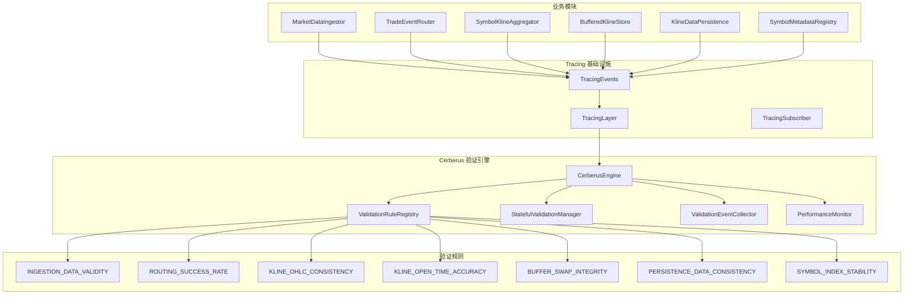
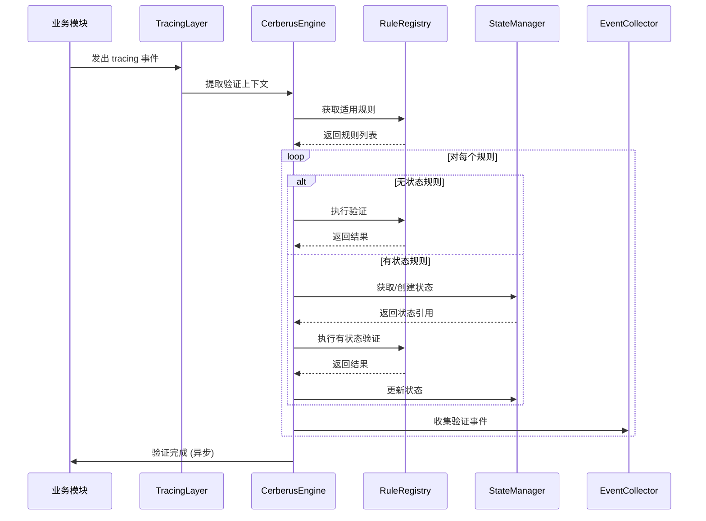
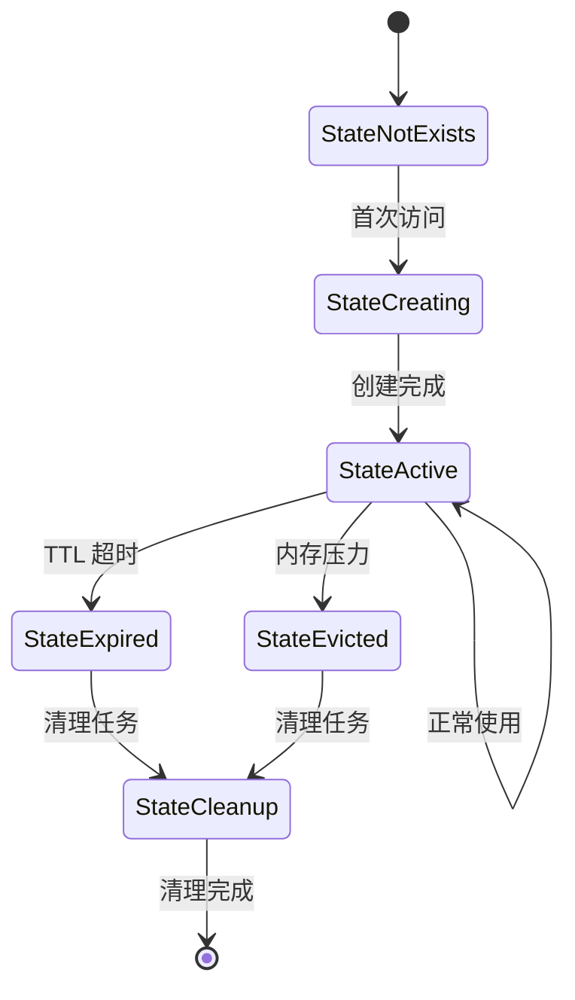

# 🏗️ Cerberus 技术架构设计

## 📐 系统架构概览



## 🔧 核心组件设计

### CerberusEngine - 验证引擎核心
```rust
pub struct CerberusEngine {
    config: Arc<CerberusConfig>,
    rule_registry: Arc<ValidationRuleRegistry>,
    state_manager: Arc<StatefulValidationManager>,
    event_collector: Arc<ValidationEventCollector>,
    performance_monitor: Arc<PerformanceMonitor>,
    is_enabled: AtomicBool,
}
```

**职责**:
- 协调所有验证组件
- 管理验证生命周期
- 提供统一的验证入口
- 处理验证异常和降级

### ValidationRuleRegistry - 规则注册表
```rust
pub struct ValidationRuleRegistry {
    rules: DashMap<String, Arc<dyn ValidationRule>>,
    rule_configs: DashMap<String, RuleConfig>,
    rule_matchers: Vec<Box<dyn RuleMatcher>>,
}
```

**职责**:
- 管理所有验证规则
- 根据上下文匹配适用规则
- 支持动态规则注册/注销
- 规则配置管理

### StatefulValidationManager - 状态管理器
```rust
pub struct StatefulValidationManager {
    states: DashMap<String, StateEntry>,
    cleanup_scheduler: tokio::task::JoinHandle<()>,
    metrics: StateMetrics,
}

struct StateEntry {
    state: Arc<RwLock<Box<dyn Any + Send + Sync>>>,
    last_access: AtomicI64,
    access_count: AtomicU64,
}
```

**职责**:
- 管理有状态验证器的状态
- 提供高并发状态访问
- 自动状态清理和内存管理
- 状态持久化支持

## 🎯 验证规则架构

### 无状态验证规则
```rust
pub trait ValidationRule: Send + Sync {
    fn id(&self) -> &str;
    fn description(&self) -> &str;
    fn validate(&self, context: &ValidationContext) -> ValidationResult;
    fn is_applicable(&self, context: &ValidationContext) -> bool;
    fn priority(&self) -> ValidationPriority;
}
```

### 有状态验证规则
```rust
pub trait StatefulValidationRule: ValidationRule {
    type State: Send + Sync + Clone + 'static;
    
    fn validate_with_state(
        &self, 
        context: &ValidationContext, 
        state: &mut Self::State
    ) -> ValidationResult;
    
    fn create_initial_state(&self) -> Self::State;
    fn get_state_key(&self, context: &ValidationContext) -> String;
    fn should_cleanup_state(&self, state: &Self::State) -> bool;
}
```

## 🔄 验证流程设计

### 验证执行流程


### 状态管理流程


## 🚀 性能优化设计

### 异步验证架构
```rust
pub struct AsyncValidationExecutor {
    validation_queue: tokio::sync::mpsc::UnboundedSender<ValidationTask>,
    worker_pool: Vec<tokio::task::JoinHandle<()>>,
    batch_processor: tokio::task::JoinHandle<()>,
}

struct ValidationTask {
    context: ValidationContext,
    rules: Vec<Arc<dyn ValidationRule>>,
    priority: ValidationPriority,
}
```

### 采样验证机制
```rust
pub struct SamplingValidator {
    inner: Arc<dyn ValidationRule>,
    sampler: Box<dyn Sampler>,
    sample_rate: AtomicU64, // 使用原子类型支持动态调整
}

pub trait Sampler: Send + Sync {
    fn should_sample(&self, context: &ValidationContext) -> bool;
}
```

### 内存池优化
```rust
pub struct ValidationContextPool {
    pool: crossbeam::queue::SegQueue<Box<ValidationContext>>,
    max_size: usize,
    created_count: AtomicUsize,
}
```

## 📊 监控和可观测性

### 验证指标收集
```rust
pub struct ValidationMetrics {
    // 执行指标
    pub total_validations: AtomicU64,
    pub successful_validations: AtomicU64,
    pub failed_validations: AtomicU64,
    pub skipped_validations: AtomicU64,
    
    // 性能指标
    pub avg_validation_time: AtomicU64,
    pub max_validation_time: AtomicU64,
    pub validation_time_histogram: Histogram,
    
    // 状态管理指标
    pub active_states: AtomicUsize,
    pub state_cache_hits: AtomicU64,
    pub state_cache_misses: AtomicU64,
    pub state_evictions: AtomicU64,
}
```

### 告警规则定义
```rust
pub struct AlertRule {
    pub name: String,
    pub condition: Box<dyn AlertCondition>,
    pub threshold: f64,
    pub window_duration: Duration,
    pub severity: AlertSeverity,
}

pub trait AlertCondition: Send + Sync {
    fn evaluate(&self, metrics: &ValidationMetrics) -> f64;
}
```

## 🛡️ 错误处理和恢复

### 异常隔离机制
```rust
pub struct ValidationCircuitBreaker {
    state: AtomicU8, // 0: Closed, 1: Open, 2: HalfOpen
    failure_count: AtomicU32,
    last_failure_time: AtomicI64,
    failure_threshold: u32,
    recovery_timeout: Duration,
}
```

### 自动降级策略
```rust
pub enum DegradationStrategy {
    DisableRule(String),
    ReduceSamplingRate(f64),
    DisableStatefulValidation,
    EmergencyShutdown,
}

pub struct DegradationManager {
    strategies: Vec<DegradationStrategy>,
    trigger_conditions: Vec<Box<dyn DegradationTrigger>>,
}
```

## 🔧 配置管理

### 分层配置设计
```rust
pub struct CerberusConfig {
    // 全局配置
    pub global: GlobalConfig,
    
    // 规则配置
    pub rules: HashMap<String, RuleConfig>,
    
    // 性能配置
    pub performance: PerformanceConfig,
    
    // 监控配置
    pub monitoring: MonitoringConfig,
}
```

### 动态配置更新
```rust
pub trait ConfigProvider: Send + Sync {
    fn get_config(&self) -> Result<CerberusConfig>;
    fn watch_config(&self) -> tokio::sync::watch::Receiver<CerberusConfig>;
}
```

## 🧪 测试架构

### 测试分层策略
1. **单元测试**: 每个组件独立测试
2. **集成测试**: 组件间协作测试
3. **性能测试**: 基准测试和压力测试
4. **混沌测试**: 异常情况和恢复测试

### 测试工具链
```rust
pub struct ValidationTestHarness {
    pub mock_context_generator: MockContextGenerator,
    pub performance_profiler: PerformanceProfiler,
    pub state_inspector: StateInspector,
    pub metrics_collector: TestMetricsCollector,
}
```

---

**架构原则**: 高性能、高可用、可扩展、可观测
