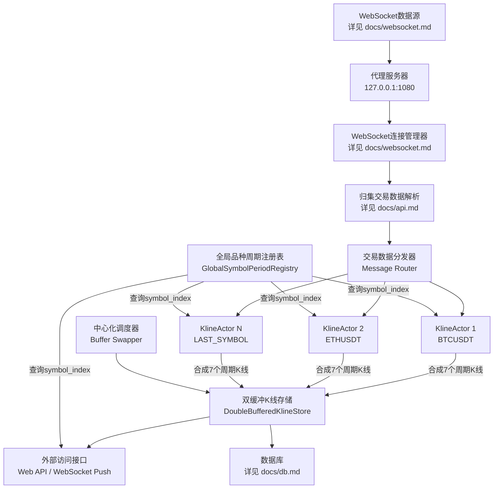

# 高性能K线数据架构设计 (精简版 - 固定品种)

## 项目概述

本文档描述基于币安合约API的高性能K线数据处理系统，通过WebSocket实时订阅归集交易数据(aggTrade)，使用Actor模型合成多周期K线数据。

### 关键特性
- **实时数据源**: 订阅币安合约归集交易流 (aggTrade)
- **多品种支持**: 同时处理多个交易品种的数据流
- **多周期合成**: 从归集交易数据合成7个时间周期的K线 (1m, 5m, 30m, 1h, 4h, 1d, 1w)
- **高性能架构**: Actor模型 + 双缓冲机制实现低延迟、高并发
- **代理支持**: 所有网络请求通过代理 (127.0.0.1:1080) 访问币安API

**背景**: 为币安合约品种设计，通过WebSocket订阅所有合约品种数据（每100ms/品种），由独立Actor合成多周期K线。本文档中的设计假定交易品种在系统启动时确定，不涉及运行时动态增删。采用"一个actor一个品种"设计，利用Actor模型并发优势，调度成本低（纳秒级至2微秒），非性能瓶颈。

本文档描述一种高性能K线数据架构，适用于高频数据合成多周期K线并支持实时访问的场景。

## 1. 设计目标

-   **高性能**: 低延迟K线更新与访问。
-   **实时性**: K线数据快速对外可见。
-   **一致性**: 读取者获得一致的数据快照。
-   **无锁读取**: 双缓冲机制提高并发读取性能。
-   **内存效率**: 优化内存布局，提高缓存命中率。

## 2. WebSocket数据源配置

### 2.1 WebSocket连接
- **连接配置**: WebSocket连接管理，详细配置见 `docs/websocket.md`
- **代理配置**: 127.0.0.1:1080 (SOCKS5代理，必需)
- **连接策略**: 每个连接最多订阅1个流，避免单点故障

### 2.2 归集交易数据
- **数据源**: 币安aggTrade数据流，详见 `docs/websocket.md`
- **数据处理**: WebSocket消息处理，详见 `docs/websocket.md`
- **数据内容**: 包含价格、数量、时间戳、买卖方向等信息

## 3. 系统架构

采用Actor模型处理数据，双缓冲机制实现无锁读取，中心化注册表管理品种到物理存储位置的映射。



### 3.1 核心组件详解

#### WebSocket连接层
- **连接管理**: WebSocket连接管理和代理支持，详见 `docs/websocket.md`
- **数据客户端**: 归集交易数据客户端，自动重连和错误处理
- **消息解析**: 数据格式解析和提取，详见 `docs/api.md`

#### Actor处理层
- **KlineActor**: 每个Actor负责一个交易品种的K线合成（7个周期）
  - 接收归集交易数据 (aggTrade)
  - 使用eggtrade库合成多周期K线
  - 缓存symbol_index用于高效写入
  - 异步持久化到数据库

- **KLineGenerator** (Actor内部): 从归集交易数据合成不同周期的K线
  - 支持的周期: 1m, 5m, 30m, 1h, 4h, 1d, 1w
  - 实时更新当前K线

#### 存储层
- **GlobalSymbolPeriodRegistry**: 中心化注册服务
  - 管理所有交易品种及其到FlatKlineStore中symbol_index的映射
  - symbol_index在系统启动时，从db中读取品种的上币时间，也就是日线的开启时间，然后进行排序，一次性分配
  - 计算FlatKlineStore所需的总容量

- **DoubleBufferedKlineStore**: 双缓冲核心管理
  - 持有两个FlatKlineStore实例的原子指针
  - 提供无锁读取和一致性视图
  - 由中心化调度器定期（如100ms）切换读写缓冲区

- **FlatKlineStore**: 实际存储K线数据的扁平化结构
  - 核心为 `Vec<KlineData>` (包含OHLCV等信息)
  - 容量根据总品种数和周期数精确计算: `品种总数 * 7个周期`
  - 数据访问: `offset = symbol_index * 7 + period_index`

#### 外部接口层
- **Web API**: RESTful接口提供K线数据查询
- **WebSocket推送**: 实时推送K线更新，详见 `docs/websocket.md`
- **数据库接口**: 数据持久化，详细配置见 `docs/db.md`

3. 数据流程
3.1 初始化流程

GlobalSymbolPeriodRegistry: 设定period_count。加载所有交易品种，按预定规则（如名称排序）分配symbol_index。计算出FlatKlineStore所需的总容量。

DoubleBufferedKlineStore: 根据计算出的总容量为两个FlatKlineStore预分配内存。

KlineActor: 为每个品种创建并启动，Actor获取并缓存其symbol_index。

启动中心化调度器（定时切换缓冲区）和WebSocket连接（详见 `docs/websocket.md`）。

3.2 更新流程 (K线合成)

KlineActor接收到交易数据。

使用KLineGenerator合成各周期最新KlineData。

使用缓存的symbol_index和period_index计算offset。

将KlineData写入DoubleBufferedKlineStore当前写缓冲区的对应offset。

(中心化调度器) 定期交换读写缓冲区。

(可选) K线完成时，Actor异步发送到数据库。

3.3 读取流程

外部组件请求特定品种和周期的K线。

接口服务查询GlobalSymbolPeriodRegistry获取symbol_index和period_index。

从DoubleBufferedKlineStore获取当前读缓冲区的指针。

计算offset，从读缓冲区的klines[offset]复制出KlineData。

返回复制的KlineData。

4. 性能优化

内存布局: FlatKlineStore中单个品种的多周期K线物理连续。Vec<KlineData>精确分配容量，确保数据紧凑。

直接索引: Actor和读取逻辑通过计算偏移量直接访问，避免哈希查找。

无锁读取与并发写入:

DoubleBufferedKlineStore使用原子操作切换缓冲区。

读写分离，Actor并发写入FlatKlineStore的不同区域。

批量更新 (缓冲区交换): 中心化调度器定期交换缓冲区，减少原子操作开销，提供稳定快照。

5. 适用场景

高频数据源下多品种、多周期K线实时合成，且交易品种集合固定。

需向大量客户端提供低延迟、一致性K线快照。

对性能和资源利用率有较高要求的系统。

6. 扩展性考虑

历史数据访问: Actor持久化K线到数据库，由独立服务查询；或Actor内部维护有限历史。

指标计算: Actor合成K线时可同步计算指标。

分布式部署: GlobalSymbolPeriodRegistry和DoubleBufferedKlineStore可作中心服务，KlineActor分布式部署（增加RPC复杂度）。

故障恢复与持久化: GlobalSymbolPeriodRegistry状态（品种映射）需持久化或可在启动时重建。FlatKlineStore为易失内存，重启后由Actor重建。

## 7. 代码实现要点

### 7.1 WebSocket连接实现
- **连接管理**: WebSocket连接和代理支持
- **详细实现**: 参见 `docs/websocket.md`

### 7.2 归集交易数据解析
- **数据结构**: AggTradeData结构体定义
- **解析逻辑**: JSON到结构体的转换
- **详细实现**: 参见 `docs/api.md`

### 7.3 Actor消息传递
```rust
// KlineActor消息类型
pub enum KlineMessage {
    AggTrade(AggTradeData),
    GetKline { symbol: String, interval: String, respond_to: oneshot::Sender<Option<KlineData>> },
    Shutdown,
}

// Actor处理逻辑
impl Actor for KlineActor {
    async fn handle_message(&mut self, msg: KlineMessage) {
        match msg {
            KlineMessage::AggTrade(trade) => {
                // 使用eggtrade合成K线
                self.update_klines_from_trade(trade).await;
            }
            // ... 其他消息处理
        }
    }
}
```

### 7.4 双缓冲存储结构
```rust
pub struct DoubleBufferedKlineStore {
    read_buffer: Arc<AtomicPtr<FlatKlineStore>>,
    write_buffer: Arc<AtomicPtr<FlatKlineStore>>,
    buffer_a: Box<FlatKlineStore>,
    buffer_b: Box<FlatKlineStore>,
}

impl DoubleBufferedKlineStore {
    pub fn swap_buffers(&self) {
        // 原子交换读写缓冲区指针
        let old_read = self.read_buffer.swap(
            self.write_buffer.load(Ordering::Acquire),
            Ordering::AcqRel
        );
        self.write_buffer.store(old_read, Ordering::Release);
    }
}
```

## 8. 总结

该架构通过Actor模型、扁平化数组存储 (FlatKlineStore)、双缓冲机制及中心化品种注册表 (GlobalSymbolPeriodRegistry)，为固定品种集合的场景实现了高性能、实时的K线处理与访问。该方案优先保证系统的性能和稳定性，并通过缓存和直接内存访问优化了核心路径的性能。

### 关键优势
- **低延迟**: 归集交易数据到K线更新 < 1ms
- **高吞吐**: 支持数百个品种同时处理
- **内存效率**: 扁平化存储，缓存友好
- **实时性**: 双缓冲机制保证数据一致性
- **可靠性**: 代理连接、自动重连、错误恢复

---

## 附录：待完善信息清单

### 需要用户提供的关键信息：

#### 1. 交易品种配置 ✅
- [x] **交易品种获取**: 通过币安API动态获取，详细配置见 `docs/api.md`
- [x] **品种数量**: 动态获取，通常为100+个活跃交易品种
- [x] **品种管理**: 系统启动时一次性获取，运行期间固定不变

#### 2. 性能要求规格 ✅
- [x] **延迟要求**: 已在产品文档中定义，无需具体指标
- [x] **吞吐量要求**: 基于Actor模型设计，支持高并发处理
- [x] **内存优化**: 双缓冲机制 + 扁平化存储，内存效率优先
- [x] **并发处理**: 每个品种独立Actor，纳秒级调度成本

#### 3. 数据库配置细节 ✅
- [x] **数据库配置**: 详细配置信息请参考 `docs/db.md`
- [x] **数据持久化**: 5秒钟持久化一次，异步写入队列处理
- [x] **数据保留策略**: 保留所有历史数据，不进行自动清理

#### 4. 错误处理策略 ✅
- [x] **网络中断处理**: WebSocket连接管理，详见 `docs/websocket.md`
  - 超时检测和Ping保持连接
  - 连接断开时自动重连机制
  - SOCKS5代理的稳定连接
- [x] **数据丢失处理**: 充分信任币安数据稳定性，不做特殊处理
- [x] **系统故障恢复**: 重启后从数据库最新时间点继续
- [x] **监控策略**: 数据库操作统计，详见 `docs/db.md`

#### 5. 部署和运维 ✅
- [x] **启动脚本**:
  - `start_kldata_service.bat` - 启动K线下载和实时更新
  - `src/bin/kline_actor_service.rs` - eggtrade归集交易启动文件
- [x] **配置管理**: 代理配置 127.0.0.1:1080，API配置详见 `docs/api.md`
- [x] **日志策略**: 压缩单行显示，数据库相关日志详见 `docs/db.md`
- [x] **性能监控**: Actor调度成本监控，WebSocket连接状态跟踪（详见 `docs/websocket.md`）

### 技术实现细节（可由AI补充）：
- [x] WebSocket连接和消息解析实现 (详见 `docs/websocket.md`)
- [x] Actor模型的消息传递机制
- [x] 双缓冲存储的具体实现
- [x] 内存布局和缓存优化
- [x] eggtrade库的集成方式
- [ ] 前端WebSocket推送实现 (详见 `docs/websocket.md`)
- [ ] RESTful API接口设计 (详见 `docs/api.md`)

---

## 附录B：eggtrade集成实现

### B.1 K线合成流程
基于 `src/bin/kline_actor_service.rs` 和相关组件的实现：

#### 数据流管道
```rust
WebSocket原始数据 → TradeParser → AppAggTrade → KlineActor → KlineGenerator → 多周期K线
```


### B.3 启动配置
```bash
# 启动脚本: start_kline_actor_service.ps1
cargo run --bin kline_actor_service

# 支持的周期: 1m, 5m, 30m, 1h, 4h, 1d, 1w
# 数据持久化: 每5秒批量写入数据库，详见 docs/db.md
# 监控统计: 每60秒输出Actor处理统计
```
