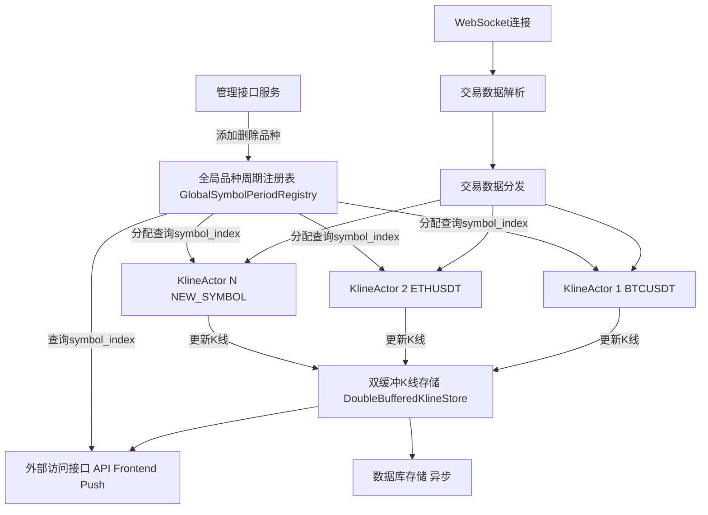

# 高性能K线数据架构设计 (修订版)

背景知识：币安的合约品种eggtrade归集交易，通过websocket订阅所有合约品种，每100毫秒每个品种得到1次数据，每次数据，只会给一个rust中的actor进行合成K线，合成6个周期的k线。系统需要支持运行时动态添加/删除交易品种。

采用"一个actor一个品种"的设计是为了充分利用actor模型带来的并发编程、抽象隔离的优势。这种设计使得不同品种的数据处理可以完全并行，互不干扰，同时actor的调度成本足够低，通常在纳秒级别，最慢到2微秒，不会成为系统性能瓶颈。

本文档描述了一种高性能K线数据架构，适用于从高频交易数据合成多周期K线并支持实时访问的场景，同时兼顾了运行时动态调整交易品种的灵活性。该架构借鉴了高频量化交易系统的设计理念，针对性能、实时性和可维护性进行了优化。

## 1. 设计目标

-   **高性能**：支持高频数据处理和低延迟的K线更新与访问。
-   **实时性**：K线数据更新后能较快对外部可见。
-   **一致性**：读取者总是看到一个时间点的一致数据快照。
-   **无锁读取**：通过双缓冲机制避免读写锁竞争，提高并发读取性能。
-   **内存效率**：优化内存布局，提高缓存命中率，同时考虑动态性带来的空间管理。
-   **动态性**：支持在系统运行时动态添加和（未来可能）删除交易品种，而对系统影响最小。

## 2. 系统架构

系统采用Actor模型处理交易数据，使用双缓冲机制实现无锁读取，并通过一个中心化的注册表管理品种到物理存储位置的映射。

### 2.1 核心组件

KlineActor：每个Actor负责处理一个交易品种的K线合成。Actor在初始化时从GlobalSymbolPeriodRegistry获取其负责品种在FlatKlineStore中的symbol_index并缓存，用于高效写入。这种"一个actor一个品种"的设计使得系统能够充分利用多核处理器的并行能力，同时actor的调度成本足够低（通常在纳秒级别，最慢到2微秒），保证了系统的高性能和低延迟。

KLineGenerator（Actor内部）：负责从交易数据为单个品种合成不同周期的K线。

GlobalSymbolPeriodRegistry：中心化的注册服务，负责：

管理所有已知交易品种及其到FlatKlineStore中symbol_index的映射。symbol_index的分配基于币种的上币日期排序：从db.rs中读取所有币种的第一根日K的开始时间，按照这个上币时间排序，排序后的次序即为symbol_index。这种方式确保新品种总是可以添加在最尾部，避免了对现有索引的重新分配。

当FlatKlineStore初始长度设置为1000，而目前币安只有约415个品种，因此容量足够，扩容操作在实际运行中不会触发。由于容量充足，即使品种退出交易导致FlatKlineStore中出现空洞，也不需要特别处理这些空洞或进行紧凑化操作。

DoubleBufferedKlineStore：双缓冲的核心管理，提供无锁读取和一致性视图的核心存储。

内部持有两个FlatKlineStore实例的原子指针。

定期（每100ms）由一个中心化调度器切换读写缓冲区。

FlatKlineStore：实际存储K线数据的扁平化结构。

内部核心为 klines: Vec<KlineData>，预分配较大容量以容纳未来新品种。

period_count: 每个品种的K线周期数量 ，7个周期，1m 5m 30m 1h 4h 1d 1w

外部访问接口：供前端或其他组件通过查询GlobalSymbolPeriodRegistry获取symbol_index后，从DoubleBufferedKlineStore的读缓冲区高效访问K线数据。

中心化调度器：一个独立的任务或线程，负责原子化，定时调用DoubleBufferedKlineStore的swap_buffers方法。

## 3. 数据结构优化与动态适应性
### 3.1 挑战与演进

### 3.3 平坦数组存储 (FlatKlineStore)
struct FlatKlineStore {
    // 单一连续数组，预分配较大容量
    // 总长度为 品种总数 * 周期总数
    // 初始容量设置为10000，而目前币安只有约415个品种，容量足够
    klines: Vec<KlineData>,
  
    // capacity: usize,             // Vec的总品种容量，初始值为10000
    // period_count: usize,         // 每个品种的周期数
}

// KlineData 代表一个特定品种特定周期的单根最新K线 (OHLCV等)
struct KlineData { /* ... */ }

数据访问通过计算偏移量实现：
offset = symbol_index * period_count + period_index

### 3.4 双缓冲机制 (DoubleBufferedKlineStore)
struct DoubleBufferedKlineStore {
    buffers: [AtomicPtr<FlatKlineStore>; 2], // 两个缓冲区
    active_write_index: AtomicUsize,         // 当前写缓冲区索引
    // 此处不直接持有SymbolMap/PeriodMap，它们由GlobalSymbolPeriodRegistry管理
}

## 4. 数据流程
### 4.1 初始化流程

初始化 GlobalSymbolPeriodRegistry：

设定初始 flat_store_capacity 和 period_count。

加载已知的交易品种（如果有），从db.rs中读取所有币种的第一根日K的开始时间，按照上币时间排序，排序后的次序作为symbol_index，并填充 symbol_to_metadata。这种基于上币日期的排序方式确保新品种总是可以添加在最尾部。

构建 period_to_index 和 index_to_period。

创建 DoubleBufferedKlineStore：

根据 flat_store_capacity（初始值为10000）和 period_count 为两个 FlatKlineStore 预分配内存。初始时，Vec<KlineData> 内的数据可以是默认/无效状态。由于目前币安只有约415个品种，这个容量足够，扩容操作在实际运行中几乎不会触发。

为每个已知品种创建并启动 KlineActor：

Actor 启动时从 GlobalSymbolPeriodRegistry 查询并缓存其负责品种的 symbol_index 及当前的 flat_store_version。

启动中心化调度器，定时（如每100ms）调用 DoubleBufferedKlineStore::swap_buffers()。

启动 WebSocket 连接，开始接收和分发交易数据。

### 4.2 更新流程 (K线合成)

KlineActor 接收到其负责品种的交易数据 (eggtrade data)。

Actor 使用内部的 KLineGenerator 合成6个周期的最新 KlineData。

Actor 使用其缓存的 symbol_index 和从 GlobalSymbolPeriodRegistry (或自身缓存) 获取的 period_indices 计算出 offset。

Actor 直接将更新后的 KlineData 写入 DoubleBufferedKlineStore 当前写缓冲区的对应 offset 位置。此操作无锁（相对于其他 Actor 的写入，因为不同 Actor 写入不同 symbol_index 区域；相对于读取者，因为双缓冲）。

(中心化调度器) 定期交换读写缓冲区。

如果K线完成（一个周期结束），Actor 可以将该根K线异步发送到数据库存储队列。

### 4.3 读取流程

外部组件通过接口请求特定品种（如"BTCUSDT"）和周期（如1分钟）的K线数据。

接口服务首先查询 GlobalSymbolPeriodRegistry 将 "BTCUSDT" 解析为 symbol_index，并将周期解析为 period_index。

接口服务从 DoubleBufferedKlineStore 获取当前读缓冲区的指针。

计算 offset = symbol_index * period_count + period_index。

从读缓冲区的 klines[offset] 复制出所需的 KlineData。复制是为了确保返回给调用者的数据是快照，不受后续缓冲区交换影响。

返回复制的 KlineData。

### 4.4 添加新品种流程

通过管理接口触发添加新品种（例如 "NEWCOINUSDT"）的请求。

请求被发送到 GlobalSymbolPeriodRegistry。

GlobalSymbolPeriodRegistry (在写锁保护下):

从db.rs中读取新品种的第一根日K的开始时间，确定其上币日期。由于新品种的上币日期通常是最新的，因此其symbol_index将被分配在现有品种之后。

检查 next_available_symbol_index < flat_store_capacity。

如果空间足够： 分配 next_available_symbol_index 给 "NEWCOINUSDT"，更新 symbol_to_metadata，递增 next_available_symbol_index。这种基于上币日期的索引分配方式确保新品种总是添加在最尾部，避免了对现有索引的重新分配。

如果空间不足（预留已用完）：

触发 FlatKlineStore 扩容流程 (这是一个较重的操作，应尽量避免)：

确定新的 flat_store_capacity_new。

创建一个新的 DoubleBufferedKlineStore_New 实例，其内部 FlatKlineStore 按新容量分配。

将旧 DoubleBufferedKlineStore_Old 中的有效数据（根据 Registry 中的映射）迁移到 DoubleBufferedKlineStore_New 的一个缓冲区中，并按需重新计算所有品种的 symbol_index。

更新 GlobalSymbolPeriodRegistry 中的 flat_store_capacity，symbol_to_metadata (所有 symbol_index 都可能改变)，并递增 flat_store_version。

原子地将系统对K线存储的引用切换到 DoubleBufferedKlineStore_New。

通过通知机制（如 watch channel 或消息）告知所有 KlineActor flat_store_version 已更新，它们需要重新查询并缓存新的 symbol_index。

安全地销毁 DoubleBufferedKlineStore_Old。

扩容完成后，为 "NEWCOINUSDT" 分配 symbol_index。

为 "NEWCOINUSDT" 创建并启动一个新的 KlineActor 实例。该 Actor 会从 Registry 获取其 symbol_index。

## 5. 性能优化
### 5.1 内存布局优化

大部分连续内存： FlatKlineStore 使用 Vec<KlineData>。单个品种的多个周期K线是物理连续的。不同品种之间由于动态性和稀疏性可能不连续。

预分配与稀疏填充： FlatKlineStore 预分配较大容量（初始值为10000），以支持动态添加品种，避免频繁的内存重分配。目前币安只有约415个品种，这个容量足够，扩容操作在实际运行中几乎不会触发。由于容量充足，即使品种退出交易导致FlatKlineStore中出现空洞，也不需要特别处理这些空洞或进行紧凑化操作。

直接索引： Actor 和读取逻辑一旦获得 symbol_index 和 period_index，通过计算偏移量直接访问数据，避免哈希计算热路径。

### 5.2 无锁读取与并发写入

原子操作： DoubleBufferedKlineStore 使用原子指针和原子索引切换缓冲区。

读写分离： 读取操作只访问不变的读缓冲区，写入操作只修改写缓冲区。

Actor并发写入： 每个 KlineActor 负责自己 symbol_index 对应的区域，不同 Actor 写入 FlatKlineStore 的不同部分，互不干扰。这种"一个actor一个品种"的设计使得不同品种的数据处理可以完全并行，同时actor的调度成本足够低（通常在纳秒级别，最慢到2微秒），不会成为系统性能瓶颈。

### 5.3 批量更新 (缓冲区交换)

定期交换： 中心化调度器定期（如每100ms）交换读写缓冲区，而不是每次K线更新后都交换，减少原子操作开销，并为读取者提供稳定的快照。

## 6. 实现示例 (概念性)
### 6.1 DoubleBufferedKlineStore
use std::sync::atomic::{AtomicPtr, AtomicUsize, Ordering};
// Assuming FlatKlineStore and KlineData are defined elsewhere
// struct FlatKlineStore { klines: Vec<KlineData> }
// struct KlineData;

struct DoubleBufferedKlineStore {
    buffers: [AtomicPtr<FlatKlineStore>; 2],
    active_write_index: AtomicUsize,
}

impl DoubleBufferedKlineStore {
    // Example: not a complete implementation
    // fn new(capacity_per_flat_store: usize) -> Self { ... }

    // 由中心化调度器调用
    fn swap_buffers(&self) {
        let current_idx = self.active_write_index.load(Ordering::Relaxed);
        self.active_write_index.store(1 - current_idx, Ordering::Release);
    }

    fn get_write_buffer_ptr(&self) -> *mut FlatKlineStore {
        let idx = self.active_write_index.load(Ordering::Acquire);
        self.buffers[idx].load(Ordering::Acquire)
    }

    fn get_read_buffer_ptr(&self) -> *const FlatKlineStore { // 返回 *const
        let idx = 1 - self.active_write_index.load(Ordering::Acquire);
        self.buffers[idx].load(Ordering::Acquire)
    }
}

### 6.2 KlineActor (概念)
use std::sync::{Arc, RwLock};
// Assuming RegistryInternal, DoubleBufferedKlineStore, KLineGenerator, KlineData, PERIOD_COUNT are defined

// Simplified conceptual actor
struct KlineActor {
    symbol: String,
    cached_symbol_index: usize,
    // cached_flat_store_version: u64,
    // period_configs: Vec<(i64, usize)>,

    // global_registry: Arc<RwLock<RegistryInternal>>,
    kline_store: Arc<DoubleBufferedKlineStore>,
    // trade_receiver, kline_generators ...
}

impl KlineActor {
    // async fn new(symbol: String, /* ... */) -> Self {
    //     // ... 初始化时从 global_registry 获取 symbol_index 和 version ...
    //     // ... 订阅 registry 的版本更新通知 ...
    //     Self { /* ... */ }
    // }

    // async fn run(&mut self /* , trade: TradeData */) { // Simplified
        // let kline_data = self.kline_generators[i].update(trade);
        // let period_index = self.period_configs[i].1;
        // let offset = self.cached_symbol_index * PERIOD_COUNT + period_index;
        // unsafe {
        //    let write_ptr_mut = self.kline_store.get_write_buffer_ptr();
        //    // Ensure write_ptr_mut is not null and offset is within bounds
        //    if !write_ptr_mut.is_null() {
        //        // (*write_ptr_mut).klines[offset] = kline_data; // Placeholder
        //    }
        // }
    // }

    // fn handle_registry_update(&mut self) {
    //    // ... 重新从 global_registry 获取 symbol_index 和 version ...
    // }
}

## 7. 适用场景

该架构特别适用于以下场景：

高频数据源下多品种、多周期K线实时合成。

需要向大量客户端提供低延迟、一致性的K线数据快照。

系统运行期间需要动态增减所覆盖的交易品种。

对性能和资源利用率有较高要求的系统。

## 8. 扩展性考虑

该架构可以进一步扩展以支持：

历史数据访问： 当前设计主要关注最新K线。历史K线可由Actor持久化到数据库，并由独立服务提供查询。或Actor内部维护有限历史的环形缓冲区。

指标计算： Actor在合成K线时可同步计算常用技术指标并存入KlineData或附属结构。

分布式部署： GlobalSymbolPeriodRegistry 和 DoubleBufferedKlineStore 可以作为中心服务，KlineActor 可以分布在多个节点上（需要RPC或其他方式与中心服务交互，复杂度增加）。

故障恢复与持久化：

GlobalSymbolPeriodRegistry 的状态（主要是品种映射和容量信息）应可持久化和恢复。

FlatKlineStore 的内容是易失的内存状态，依赖Actor从数据源重新合成或从持久化存储加载。系统重启后，Actor会重新填充。

更精细的槽位管理： 在GlobalSymbolPeriodRegistry中实现对已删除品种的symbol_index槽位的复用，以提高空间利用率，延迟扩容需求。不过，由于FlatKlineStore初始容量设置为10000，而目前币安只有约415个品种，容量足够充裕，即使品种退出交易导致FlatKlineStore中出现空洞，也不需要特别处理这些空洞或进行紧凑化操作，这种优化在当前系统中优先级较低。

## 9. 总结

本文档描述的高性能K线数据架构，通过采用Actor模型、扁平化稀疏数组存储 (FlatKlineStore)、双缓冲机制以及中心化的品种注册表 (GlobalSymbolPeriodRegistry)，实现了高性能、实时的K线数据处理和访问，同时兼顾了运行时动态添加交易品种的灵活性。该方案优先保证了系统的持续可用性和动态适应性，并通过缓存和直接内存访问优化了核心路径的性能。当对全量扫描有极致性能需求或空间成为瓶颈时，可考虑引入定期“碎片整理”或更激进的紧凑存储策略作为后续优化。

