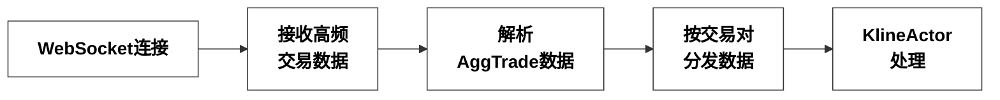
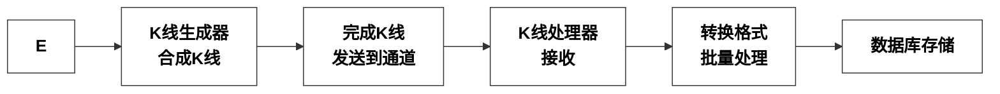
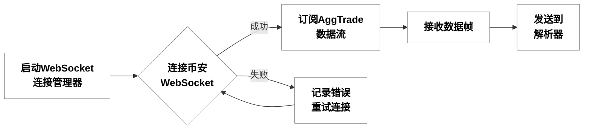
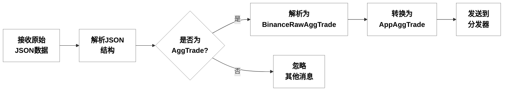
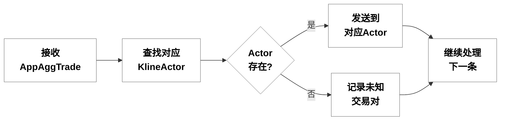
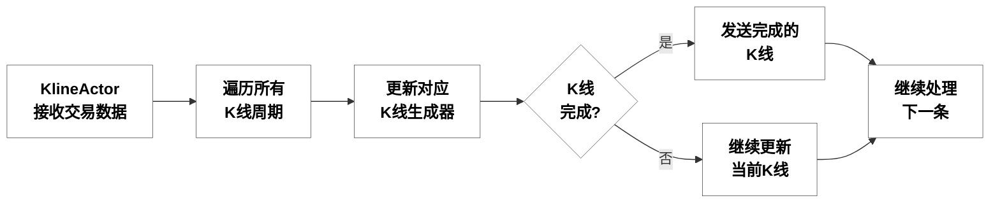
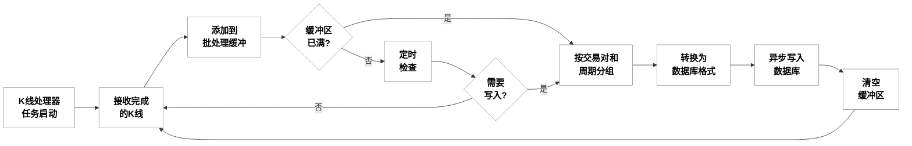
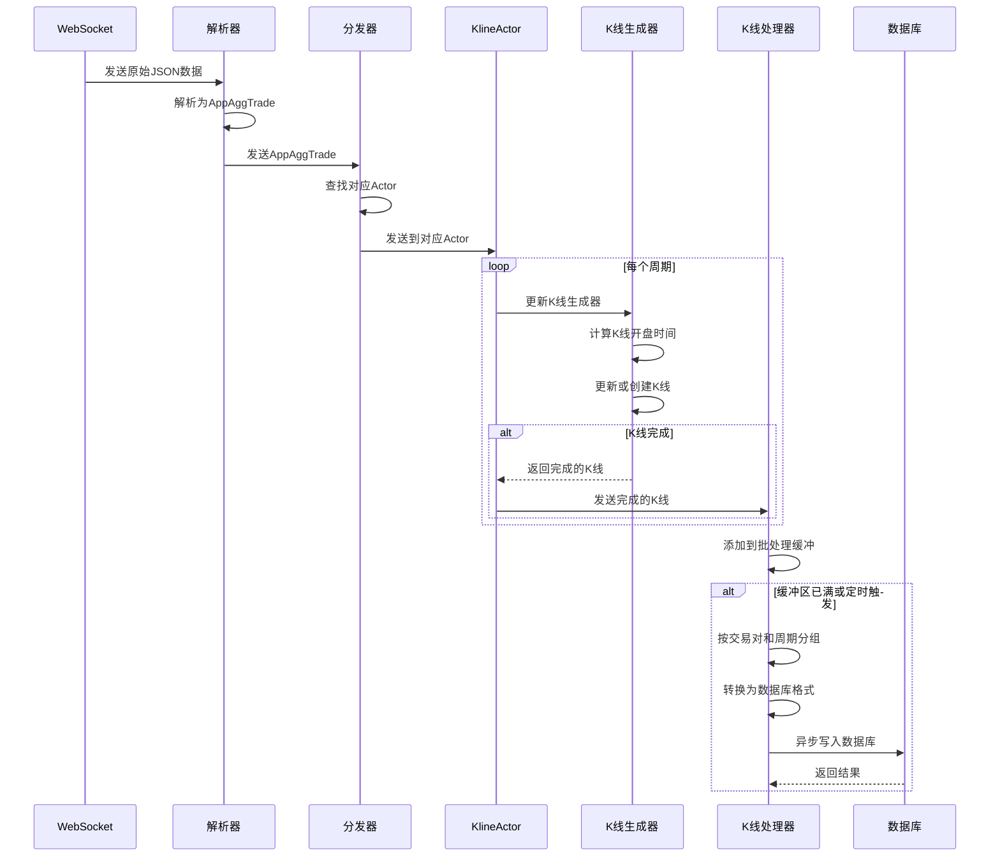

# Actor模型K线合成与存储流程详解

本文档详细描述了基于Actor模型的高频交易数据处理、K线合成与数据库存储的完整流程。

## 1. 总体流程概览

### 第一行：数据接收与分发

### 第二行：K线合成与处理

## 2. 详细流程分解

### 2.1 WebSocket连接与数据接收

相关类和函数:
- `ConnectionManager` 类 (src\klcommon\websocket.rs)
  - `connect(stream_names)` - 连接WebSocket并订阅指定的数据流
- `run_websocket_connection_task` 函数 (src\klcommon\aggkline\websocket_handler.rs)
  - 处理WebSocket连接和数据接收

逻辑描述:
该模块负责建立与币安WebSocket服务器的连接，并接收高频交易数据。系统使用多个WebSocket连接（默认5个），每个连接负责一部分交易对的数据订阅，以提高并发性能。连接成功后，系统会订阅每个交易对的AggTrade数据流，格式为"symbol@aggTrade"。接收到的数据帧会被发送到解析器进行处理。如果连接失败，系统会记录错误并尝试重新连接。这种设计确保了系统能够持续接收高频交易数据，即使在网络不稳定的情况下也能保持数据流的连续性。

### 2.2 交易数据解析

相关类和函数:
- `run_trade_parser_task` 函数 (src\klcommon\aggkline\trade_parser.rs)
  - 解析原始WebSocket消息
- `parse_agg_trade` 函数 (src\klcommon\aggkline\trade_parser.rs)
  - 解析AggTrade数据
- `BinanceRawAggTrade` 结构体 (src\klcommon\models.rs)
  - 表示币安原始AggTrade数据
- `AppAggTrade` 结构体 (src\klcommon\models.rs)
  - 表示应用内部AggTrade数据

逻辑描述:
该模块负责解析从WebSocket接收到的原始JSON数据。首先，系统会尝试将JSON字符串解析为JSON对象，然后检查是否为AggTrade消息（通过检查"e"字段是否为"aggTrade"）。如果是AggTrade消息，系统会将其解析为`BinanceRawAggTrade`结构体，该结构体与币安API返回的数据格式一致。然后，系统会将`BinanceRawAggTrade`转换为`AppAggTrade`结构体，这个过程中会将价格和数量从字符串转换为浮点数，以便后续计算。最后，系统会将`AppAggTrade`发送到分发器进行处理。如果不是AggTrade消息，系统会忽略它。这种设计确保了系统只处理需要的数据，并将其转换为适合后续处理的格式。

### 2.3 交易数据分发

相关类和函数:
- `run_app_trade_dispatcher_task` 函数 (src\klcommon\aggkline\trade_dispatcher.rs)
  - 将解析后的交易数据分发给对应的KlineActor

逻辑描述:
该模块负责将解析后的交易数据分发给对应的KlineActor。系统维护了一个交易对到Actor发送器的映射表，每个交易对对应一个KlineActor。当接收到一条AppAggTrade数据时，系统会根据其symbol字段查找对应的Actor发送器。如果找到，则将数据发送到该Actor；如果未找到，则记录一条警告日志，表示收到了未知交易对的数据。这种设计实现了"按品种分发，独立处理"的策略，每个交易对的数据由专门的Actor处理，提高了并发性能，同时避免了不同交易对之间的数据干扰。

### 2.4 K线合成

相关类和函数:
- `KlineActor` 类 (src\klcommon\aggkline\kline_actor.rs)
  - `run()` - 运行Actor，处理交易数据
- `KlineGenerator` 类 (src\klcommon\aggkline\kline_generator.rs)
  - `update_with_trade(trade)` - 使用交易数据更新K线

逻辑描述:
该模块是K线合成的核心，负责将高频交易数据合成为不同周期的K线。每个KlineActor负责一个交易对的所有周期K线合成。当Actor接收到一条交易数据时，会遍历所有支持的K线周期（如1分钟、5分钟、30分钟等），对每个周期调用对应的K线生成器的`update_with_trade`方法。

K线生成器会根据交易时间戳计算其所属的K线周期，公式为`kline_open_time_ms = (trade_timestamp_ms / period_ms) * period_ms`。这确保了同一周期内的所有交易都会被归入同一个K线。如果交易属于当前正在形成的K线，则更新该K线的高低价、收盘价、成交量等数据；如果交易属于新的K线周期，则完成当前K线并返回，同时创建新的K线。完成的K线会被发送到一个专门的通道，等待后续处理。

### 2.5 K线处理与数据库存储

相关类和函数:
- `KlineProcessor` 类 (src\klcommon\aggkline\kline_processor.rs)
  - `run()` - 运行处理任务
  - `process_batch(kline_batch)` - 批量处理K线数据
  - `ms_to_interval(period_ms)` - 将毫秒周期转换为标准周期字符串
- `Database` 类 (src\klcommon\db.rs)
  - `save_klines(symbol, interval, klines)` - 保存K线数据到数据库
- `KlineBar` 结构体 (src\klcommon\models.rs)
  - 表示内存中的K线数据
  - `to_kline()` - 转换为数据库存储格式

逻辑描述:
该模块作为K线合成和数据库存储之间的中间层，负责数据转换、批处理和缓冲。处理任务会接收从KlineActor发送来的完成K线，将其添加到批处理缓冲区。当缓冲区达到一定大小（默认100条）或定时检查时间到达时，系统会按交易对和周期对K线数据进行分组，将每组数据转换为数据库存储格式，然后使用`tokio::task::spawn_blocking`异步写入数据库。

在处理过程中，系统会将`KlineBar`（内存中的K线表示，使用浮点数）转换为`Kline`（数据库存储格式，使用字符串），这个过程中会将浮点数转换为字符串，以保持精度。同时，系统会将毫秒表示的周期（如60000ms）转换为标准周期字符串（如"1m"），以便与数据库表命名规则保持一致。

数据库表使用`k_{symbol}_{interval}`格式命名，如`k_btc_1m`表示比特币1分钟K线表。每个表使用`open_time`字段作为主键，确保每个时间点只有一条K线记录。如果发生主键冲突，系统会使用事务机制更新已存在的记录，确保数据一致性。

## 3. 数据结构

### 3.1 核心数据结构

相关类:
- `AppAggTrade` - 定义在 src\klcommon\models.rs 中，表示应用内部的交易数据
- `KlineBarDataInternal` - 定义在 src\klcommon\models.rs 中，表示K线内部数据结构
- `KlineBar` - 定义在 src\klcommon\models.rs 中，表示完整的K线Bar数据
- `Kline` - 定义在 src\klcommon\models.rs 中，表示数据库存储格式的K线数据

逻辑描述:
系统使用了几个关键的数据结构来表示和处理K线数据。`AppAggTrade`结构体表示解析后的交易数据，包含交易对、价格、数量、时间戳和买方是否做市方等信息，价格和数量使用浮点数表示，便于计算。`KlineBarDataInternal`结构体表示K线的内部数据，不包含交易对和周期信息，用于K线生成器内部维护当前正在形成的K线。`KlineBar`结构体表示完整的K线Bar数据，包含交易对、周期和所有K线数据，同样使用浮点数表示价格和数量。`Kline`结构体表示数据库存储格式的K线数据，与币安API返回的K线数据格式一致，使用字符串表示价格和数量，以保持精度。

### 3.2 数据库表结构

每个品种和周期组合都有一个独立的表，表名格式为：`k_symbol_interval`（例如：`k_btc_1m`）

数据库使用SQLite的WAL模式和其他性能优化设置。

逻辑描述:
数据库采用了分表策略，为每个交易对和时间周期组合创建独立的表，表名遵循`k_symbol_interval`的格式。例如，比特币1分钟K线存储在`k_btc_1m`表中。每个表的主键是`open_time`字段，确保了K线数据的唯一性。表结构包含了K线的所有字段，与`Kline`结构体对应。

系统使用SQLite数据库，并启用了WAL（Write-Ahead Logging）模式，这种模式提供了更好的并发性能和崩溃恢复能力。此外，还应用了多项性能优化设置，如增加缓存大小、使用内存映射、调整同步模式等，以提高数据库的读写性能。这种分表设计和性能优化使得系统能够高效地存储和查询大量的K线数据，同时保持良好的扩展性。

## 4. 完整流程时序图

## 5. 关键点和优化

1. **Actor模型**：使用Actor模型实现高并发处理，每个交易对由独立的Actor处理，避免了锁竞争
2. **批处理机制**：使用批处理和事务机制提高数据库写入性能，减少I/O操作
3. **数据类型优化**：内存中使用浮点数进行计算，存储时使用字符串保持精度
4. **主键设计**：使用K线开盘时间作为主键，确保数据唯一性和查询效率
5. **WAL模式**：使用SQLite的WAL模式提高写入性能和并发性
6. **多连接策略**：使用多个WebSocket连接分担负载，提高数据接收能力
7. **内存管理**：使用通道和批处理机制控制内存使用，避免内存溢出

## 6. 异常情况处理

1. **WebSocket断连**：自动重连机制，确保数据流的连续性
2. **解析错误**：记录错误信息但不中断处理流程，确保系统稳定运行
3. **未知交易对**：记录警告日志但不阻塞其他交易对的处理
4. **数据库写入失败**：使用事务机制，失败时回滚，避免数据不一致
5. **内存压力**：通过批处理大小和通道容量控制内存使用，避免OOM
6. **时间戳异常**：K线开盘时间计算公式确保了时间戳的一致性和连续性

## 7. 主程序入口

相关文件和函数:
- `src\bin\kline_actor_service.rs`
  - `main()` - 程序入口点

逻辑描述:
主程序入口位于`src\bin\kline_actor_service.rs`文件的`main()`函数，它是整个系统的启动点。该函数首先初始化日志系统，设置适当的日志级别和格式。然后创建SQLite数据库连接，使用WAL模式和其他性能优化设置。接着获取所有交易对，并按照指定的连接数量将交易对分组，每组交易对由一个WebSocket连接负责。

然后，程序创建并启动多个异步任务：WebSocket连接任务、交易解析任务、交易分发任务和K线处理器任务。这些任务通过通道相互连接，形成一个完整的数据处理流水线。最后，程序创建并启动所有KlineActor，每个Actor负责一个交易对的所有周期K线合成。

程序使用tokio运行时执行所有异步任务，并等待它们完成。这种设计使得系统能够充分利用多核处理器，提高并发性能，同时保持代码的清晰和可维护性。

## 8. 总结

本文档详细描述了基于Actor模型的高频交易数据处理、K线合成与数据库存储的完整流程。系统通过WebSocket接收高频交易数据，解析为内部格式，按交易对分发给对应的KlineActor，由Actor合成不同周期的K线，然后通过K线处理器转换格式并批量存储到SQLite数据库。

系统的设计遵循了三层架构的思想：
1. **K线合成层**（Actor）：负责从高频数据生成K线
2. **数据处理中间层**（Processor）：负责数据转换、批处理和缓冲
3. **数据库访问层**（Database）：统一的数据库接口，处理实际的数据库操作

这种分层设计使得系统具有高并发性能和良好的扩展性，能够处理大量交易对和多个时间周期的K线合成。同时，通过职责分离，使得代码更加清晰，每个模块都专注于自己的职责，便于维护和测试。

系统还实现了多项优化措施，如批处理机制、WAL模式、多连接策略等，提高了数据处理和存储的效率。同时，系统具有健壮的错误处理机制，能够应对各种异常情况，确保系统的稳定运行。

主要文件和类：
- `src\bin\kline_actor_service.rs`: 主程序入口
- `src\klcommon\aggkline\kline_actor.rs`: `KlineActor` 类，负责K线合成
- `src\klcommon\aggkline\kline_generator.rs`: `KlineGenerator` 类，负责K线生成
- `src\klcommon\aggkline\trade_parser.rs`: 交易解析模块
- `src\klcommon\aggkline\trade_dispatcher.rs`: 交易分发模块
- `src\klcommon\aggkline\kline_processor.rs`: `KlineProcessor` 类，负责数据处理和转换
- `src\klcommon\db.rs`: `Database` 类，统一的数据库访问接口
- `src\klcommon\models.rs`: `AppAggTrade`, `KlineBar`, `Kline` 等数据模型
- `src\klcommon\websocket.rs`: WebSocket连接管理模块
