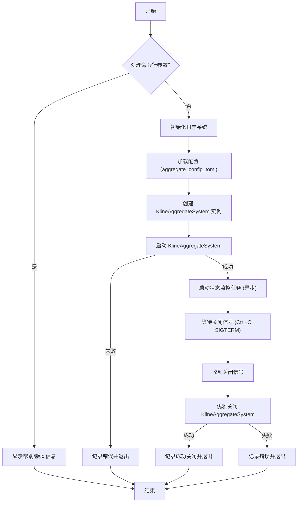
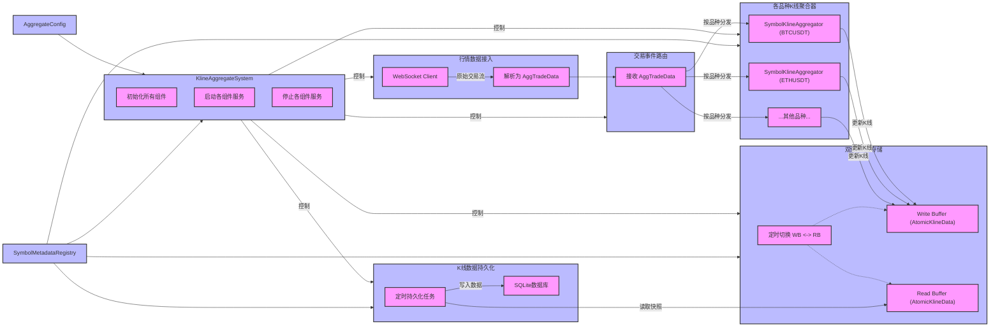

# K线聚合服务 (`kline_aggregate_service.rs`) 功能分析与流程图

## 1. 简介

`kline_aggregate_service.rs` 是K线聚合系统的主要启动入口。它负责初始化整个应用，包括加载配置、设置日志、创建和启动核心的K线聚合服务，并处理应用的生命周期（启动、运行、监控、关闭）。

## 2. 核心组件与功能

该启动文件主要包含以下几个核心部分：

*   **`main` 函数**: 异步主函数，整个服务的入口点。
*   **`handle_args` 函数**: 处理命令行参数，如 `-h` (帮助) 和 `-v` (版本)。
*   **`init_logging` 函数**: 初始化日志系统 (env_logger)，允许通过 `RUST_LOG` 环境变量配置日志级别。
*   **`load_config` 函数**: 加载聚合服务的配置。它会尝试从 `CONFIG_PATH` 环境变量指定的路径或默认路径 (`config/aggregate_config.toml`) 加载配置。如果配置文件不存在，会使用默认配置并尝试保存一份到默认路径。
*   **`KlineAggregateSystem`**: 这是核心的K线聚合逻辑的封装。`main` 函数会创建其实例，并调用其 `new`, `start`, 和 `stop` 方法来管理其生命周期。
*   **`start_status_monitor` 函数**: 启动一个后台异步任务，定期（每60秒）获取并打印 `KlineAggregateSystem` 的状态信息，如处理的交易品种数量、活跃连接数等。
*   **`wait_for_shutdown_signal` 函数**: 监听操作系统的关闭信号 (如 `Ctrl+C` 或 `SIGTERM` on Unix-like systems)，以便进行优雅关闭。
*   **`show_help` 函数**: 显示服务的帮助信息，包括用法、选项和环境变量。
*   **`show_version` 函数**: 显示服务的版本信息。

## 3. 服务启动流程

服务启动时，会按以下顺序执行操作：

1.  **处理命令行参数**: 检查是否有 `-h` 或 `-v` 等参数。如果提供了这些参数，则显示相应信息并退出。
2.  **初始化日志系统**: 设置日志记录器，以便后续操作可以输出日志。
3.  **加载配置**: 从文件或默认值加载 `AggregateConfig`。
4.  **创建 `KlineAggregateSystem`**: 使用加载的配置实例化核心聚合系统。
5.  **启动 `KlineAggregateSystem`**: 调用聚合系统的 `start()` 方法，开始数据接入、聚合等核心逻辑。
6.  **启动状态监控**: 启动一个独立的 Tokio 任务，定期打印系统状态。
7.  **等待关闭信号**: 主线程阻塞，等待用户或系统发出关闭信号。

## 4. 运行时操作

服务启动后，主要进行以下操作：

*   **K线聚合**: `KlineAggregateSystem` 内部处理来自市场的数据，进行K线聚合和可能的存储。
*   **状态监控**: `start_status_monitor` 任务定期输出系统运行状态到日志。

## 5. 服务关闭流程

当接收到关闭信号 (如 `Ctrl+C`) 时：

1.  **记录关闭信号**: 日志中会记录收到的信号类型。
2.  **优雅关闭 `KlineAggregateSystem`**: 调用聚合系统的 `stop()` 方法，允许其完成当前任务、释放资源等。
3.  **服务退出**: `main` 函数结束，进程退出。

## 6. 配置管理

*   配置文件路径可以通过 `CONFIG_PATH` 环境变量指定。
*   默认配置文件路径为 `config/aggregate_config.toml`。
*   如果配置文件不存在，服务会使用内部定义的默认配置，并尝试将这份默认配置保存到默认路径，方便用户后续修改。

## 7. 日志管理

*   使用 `env_logger` 进行日志管理。
*   日志级别可以通过 `RUST_LOG` 环境变量控制 (例如 `RUST_LOG=info` 或 `RUST_LOG=debug`)。
*   日志会包含时间戳。

## 8. 命令行接口

服务支持以下命令行参数和环境变量：

*   **参数**:
    *   `-h`, `--help`: 显示帮助信息。
    *   `-v`, `--version`: 显示版本信息。
*   **环境变量**:
    *   `CONFIG_PATH`: 指定配置文件的路径。
    *   `RUST_LOG`: 指定日志级别 (如 `info`, `debug`, `warn`, `error`)。

## 9. `kline_aggregate_service.rs` 启动流程图 (Mermaid)



## 10. `kline_aggregate_service.rs` 关键代码段分析

<-- (保持原有代码段分析不变) -->

## 11. K-line 聚合核心模块 (`src/klaggregate`) 详细分析

`src/klaggregate` 目录包含了K线聚合系统的核心逻辑。以下是对该目录下主要模块的分析：

### `mod.rs` - K线聚合系统协调器 (`KlineAggregateSystem`)

*   **主要职责**: 作为整个K线聚合功能的核心协调器。它初始化并管理所有其他 `klaggregate` 子模块。
*   **核心组件**: `KlineAggregateSystem` 结构体。
*   **启动流程 (`new` 和 `start` 方法)**:
    1.  **`new()`**: 
        *   创建 `SymbolMetadataRegistry` (交易品种元数据注册表)。
        *   创建 `BufferedKlineStore` (双缓冲K线存储)。
        *   创建 `KlineDataPersistence` (K线数据持久化模块)。
        *   创建 `TradeEventRouter` (交易事件路由模块)。
        *   创建 `MarketDataIngestor` (行情数据接入模块)。
    2.  **`start()`**:
        *   启动 `BufferedKlineStore` 的调度器 (定时切换缓冲区)。
        *   启动 `KlineDataPersistence` (开始定时持久化任务)。
        *   调用 `initialize_aggregators()`: 为 `SymbolMetadataRegistry` 中注册的每个交易品种创建并启动一个 `SymbolKlineAggregator` 实例，并将其注册到 `TradeEventRouter`。
        *   启动 `MarketDataIngestor` (开始接收WebSocket行情数据)。
*   **关闭流程 (`stop` 方法)**:
    1.  停止 `MarketDataIngestor`。
    2.  停止 `KlineDataPersistence`。
    3.  停止 `BufferedKlineStore` 的调度器。
*   **状态获取 (`get_status` 方法)**: 提供系统当前运行状态，如活跃品种数、连接数、缓冲切换次数等。

### `types.rs` - 核心数据类型

*   **主要职责**: 定义系统中使用的核心数据结构，特别注意内存对齐以优化性能。
*   **关键结构体**:
    *   `AggTradeData`: 从WebSocket接收的原始归集交易数据解析后的结构。
    *   `KlineData`: 内存对齐优化的K线结构，用于存储聚合后的K线信息 (OHLCV, 成交额, 笔数等)。使用 `#[repr(C, align(64))]` 确保按CPU缓存行大小对齐，避免false sharing。
    *   `AtomicKlineData`: `KlineData` 的原子版本，用于在双缓冲存储中实现无锁并发访问。
    *   `SymbolInfo`: 存储交易品种的元数据 (名称, 索引, 上市时间)。
    *   `PeriodInfo`: 存储K线周期的元数据 (周期字符串, 索引, 毫秒时长)。
    *   `constants.rs` (可能在此引用或内联): 定义系统中使用的一些常量，如默认K线周期、最大品种数等。

### `config.rs` - 配置管理 (`AggregateConfig`)

*   **主要职责**: 定义K线聚合系统的所有配置项，并提供加载、保存和验证配置的功能。
*   **核心结构体**: `AggregateConfig`，它包含了以下子配置：
    *   `DatabaseConfig`: 数据库相关配置 (路径, 连接池大小等)。
    *   `WebSocketConfig`: WebSocket连接相关配置 (URL, 代理, 超时, 重连等)。
    *   `BufferConfig`: 内存缓冲区相关配置 (初始容量, 预分配等)。
    *   `PersistenceConfig`: 数据持久化相关配置 (批量大小, 队列大小等)。
*   **功能**: 
    *   提供 `Default` 实现以生成默认配置。
    *   `from_file(path)`: 从TOML配置文件加载配置。
    *   `save_to_file(path)`: 将当前配置保存到TOML文件。
    *   `validate()`: 校验配置项的有效性 (例如，周期列表不能为空，数值在合理范围等)。

### `symbol_metadata_registry.rs` - 交易品种元数据注册表 (`SymbolMetadataRegistry`)

*   **主要职责**: 管理所有交易品种的元数据，包括分配品种索引、查询上市时间、维护品种名与索引之间的映射关系。
*   **初始化流程 (`new` 和 `initialize_symbol_info`)**:
    1.  从币安API (`BinanceApi`) 获取当前所有活跃的U本位永续合约交易品种列表。
    2.  查询每个品种的上市时间 (优先从本地数据库 `Database` 获取最早的1分钟K线时间，若无则可能使用API或默认值)。
    3.  按上市时间对品种进行排序。
    4.  为品种分配从0开始的连续索引，直到达到配置中的 `max_symbols` 上限。
    5.  存储品种名到索引、索引到品种名以及品种详细信息 (`SymbolInfo`) 的映射。
*   **其他功能**: 
    *   提供接口查询品种索引、品种名称、品种信息、所有已注册品种等。
    *   计算扁平化索引 (`calculate_flat_index`)，用于在 `BufferedKlineStore` 中定位特定品种特定周期的K线数据槽位。
    *   获取总的K线存储槽数量 (`get_total_kline_slots`)。

### `buffered_kline_store.rs` - 双缓冲K线存储 (`BufferedKlineStore`)

*   **主要职责**: 实现一个高性能、自调度的双缓冲K线数据存储机制，支持近乎无锁的并发读写。
*   **核心设计**: 
    *   使用两个缓冲区 (`write_buffer` 和 `read_buffer`)，每个缓冲区都是一个 `Vec<AtomicKlineData>`。
    *   `write_buffer` 用于当前K线数据的写入（由 `SymbolKlineAggregator` 更新）。
    *   `read_buffer` 用于提供稳定的K线数据快照供读取（例如，由 `KlineDataPersistence` 持久化）。
    *   通过一个定时调度器 (`start_scheduler`)，定期（由 `buffer_swap_interval_ms` 配置）原子地交换 `write_buffer` 和 `read_buffer` 的角色 (通过 `std::mem::swap`)。
*   **数据访问**: 
    *   写入 (`write_kline_data`): 更新 `write_buffer` 中对应槽位的 `AtomicKlineData`。
    *   读取 (`read_kline_data`): 从 `read_buffer` 中读取对应槽位的 `AtomicKlineData` 并转换为 `KlineData`。
    *   快照 (`get_read_buffer_snapshot`): 获取当前 `read_buffer` 的一个数据副本，用于持久化等操作。
*   **依赖**: `SymbolMetadataRegistry` (用于计算扁平化索引)。

### `symbol_kline_aggregator.rs` - 单品种K线聚合器 (`SymbolKlineAggregator`)

*   **主要职责**: 负责单个交易品种在所有配置支持的时间周期上的实时K线聚合。
*   **核心逻辑 (`process_agg_trade`)**: 
    1.  接收一个 `AggTradeData` (归集交易数据)。
    2.  遍历该品种支持的所有时间周期 (如1m, 5m, 1h等)。
    3.  对于每个周期，维护一个 `KlineAggregationState`，其中包含当前周期的 `KlineData`。
    4.  **周期判断**: 
        *   如果当前交易时间超出了当前K线的周期范围 (例如，1分钟K线，当前时间进入了下一分钟)，则认为当前K线已完成 (`is_final = true`)，将其写入 `BufferedKlineStore`，然后重置 `KlineAggregationState` 以开始新的K线周期。
        *   如果交易时间仍在当前K线周期内，则更新OHLCV等数据。
    5.  **数据聚合**: 
        *   如果是新K线的第一个tick，设置开盘价。
        *   更新最高价、最低价。
        *   设置收盘价为当前交易价格。
        *   累加成交量、成交额、成交笔数。
        *   累加主动买入量/额。
    6.  将更新后的 (可能未完成的) `KlineData` 写入 `BufferedKlineStore`。
*   **状态管理**: 每个聚合器内部为每个支持的周期维护独立的聚合状态。

### `trade_event_router.rs` - 交易事件路由 (`TradeEventRouter`)

*   **主要职责**: 将从 `MarketDataIngestor` 接收到的 `AggTradeData` 路由到对应交易品种的 `SymbolKlineAggregator` 实例进行处理。
*   **核心机制**: 
    *   维护一个 `HashMap<String, Arc<SymbolKlineAggregator>>`，将交易品种名称映射到其聚合器实例。
    *   `register_aggregator`: 由 `KlineAggregateSystem` 在初始化时调用，为每个品种注册其聚合器。
    *   `route_trade_event`: 接收交易数据，根据品种名称查找对应的聚合器，并调用其 `process_agg_trade` 方法。
*   **统计**: 记录每个品种的路由次数和总体错误次数。

### `market_data_ingestor.rs` - 行情数据接入 (`MarketDataIngestor`)

*   **主要职责**: 通过WebSocket连接到币安服务器，订阅所有已注册品种的归集交易流 (`aggTrade`)，接收数据，解析为 `AggTradeData`，然后通过 `TradeEventRouter` 进行分发。
*   **核心流程**: 
    1.  从 `TradeEventRouter` 获取所有已注册的交易品种列表。
    2.  根据配置 (URL, 代理等) 建立WebSocket连接 (具体实现依赖 `klcommon::websocket` 模块)。
    3.  订阅所有品种的 `aggTrade` 流。
    4.  在收到WebSocket消息时，将其解析为 `BinanceRawAggTrade`，再转换为 `AggTradeData`。
    5.  将 `AggTradeData` 发送给 `TradeEventRouter` 进行路由。
*   **连接管理**: 处理连接、断线重连、心跳等WebSocket生命周期事件。
*   **统计**: 记录连接数、接收消息数、错误数等。

### `kline_data_persistence.rs` - K线数据持久化 (`KlineDataPersistence`)

*   **主要职责**: 定期将 `BufferedKlineStore` 中已形成的K线数据快照持久化到数据库 (SQLite)。
*   **核心流程 (`start_persistence_task` 和 `execute_persistence_task`)**: 
    1.  启动一个定时任务，按配置的 `persistence_interval_ms` 间隔执行。
    2.  在每次执行时，从 `BufferedKlineStore` 获取 `read_buffer` 的数据快照 (`get_read_buffer_snapshot`)。
    3.  遍历快照中的 `KlineData`。
    4.  将有效的 (非空且 `is_final` 可能为true或false，取决于策略) `KlineData` 转换为数据库记录格式 (`klcommon::Kline`)。
    5.  批量写入数据库 (通过 `Database` 模块提供的接口)。
*   **并发控制**: 使用 `Semaphore` 限制并发执行的持久化任务数量，避免数据库过载。
*   **统计**: 记录持久化次数、成功次数、失败次数等。

## 12. `KlineAggregateSystem` 内部交互流程图 (Mermaid)




### `main` 函数结构

```rust
async fn main() -> Result<()> {
    // 1. 处理命令行参数
    if !handle_args() { return Ok(()); }

    // 2. 初始化日志
    init_logging()?;

    info!("启动K线聚合服务...");

    // 3. 加载配置
    let config = load_config().await?;

    // 4. 创建K线聚合系统
    let system = KlineAggregateSystem::new(config).await?;

    // 5. 启动系统
    system.start().await?;

    info!("K线聚合服务启动完成");

    // 6. 启动状态监控
    start_status_monitor(system.clone()).await;

    // 7. 等待关闭信号
    wait_for_shutdown_signal().await;

    // 8. 优雅关闭
    info!("收到关闭信号，开始优雅关闭...");
    system.stop().await?;
    info!("K线聚合服务已优雅关闭");

    Ok(())
}
```

### `load_config` 函数逻辑

```rust
async fn load_config() -> Result<AggregateConfig> {
    let config_path = std::env::var("CONFIG_PATH").unwrap_or_else(|_| DEFAULT_CONFIG_PATH.to_string());
    
    if Path::new(&config_path).exists() {
        // 从文件加载
        AggregateConfig::from_file(&config_path)
    } else {
        // 使用默认配置，并尝试保存
        warn!("配置文件不存在: {}，使用默认配置", config_path);
        let config = AggregateConfig::default();
        // ... (尝试创建目录和保存文件)
        Ok(config)
    }
}
```

### `start_status_monitor` 异步任务

```rust
async fn start_status_monitor(system: KlineAggregateSystem) {
    tokio::spawn(async move {
        let mut interval = tokio::time::interval(Duration::from_secs(60));
        loop {
            interval.tick().await;
            let status = system.get_status().await;
            info!("系统状态 - ...", status.total_symbols, ...);
        }
    });
}
```

### `wait_for_shutdown_signal` 信号处理

```rust
async fn wait_for_shutdown_signal() {
    let ctrl_c = async { signal::ctrl_c().await... };

    #[cfg(unix)]
    let terminate = async { /* ... SIGTERM handling ... */ };
    #[cfg(not(unix))]
    let terminate = std::future::pending::<()>();

    tokio::select! {
        _ = ctrl_c => { info!("收到Ctrl+C信号"); },
        _ = terminate => { info!("收到SIGTERM信号"); },
    }
}
```