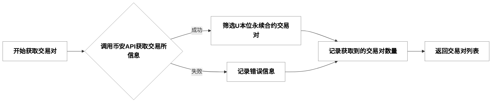
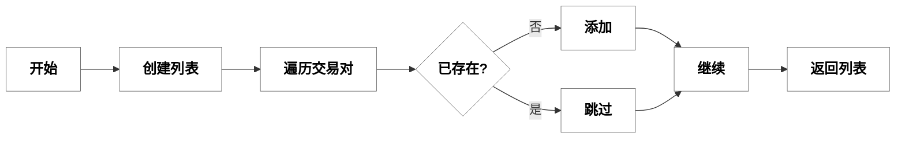
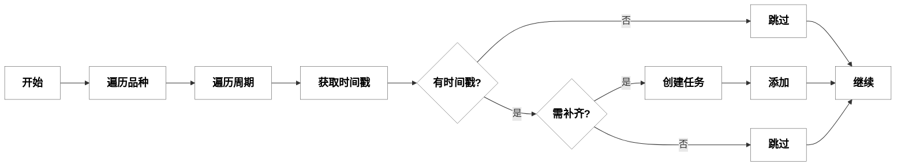
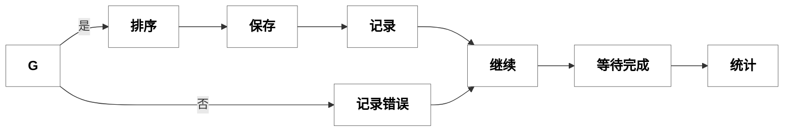
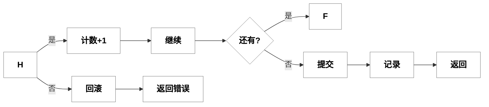
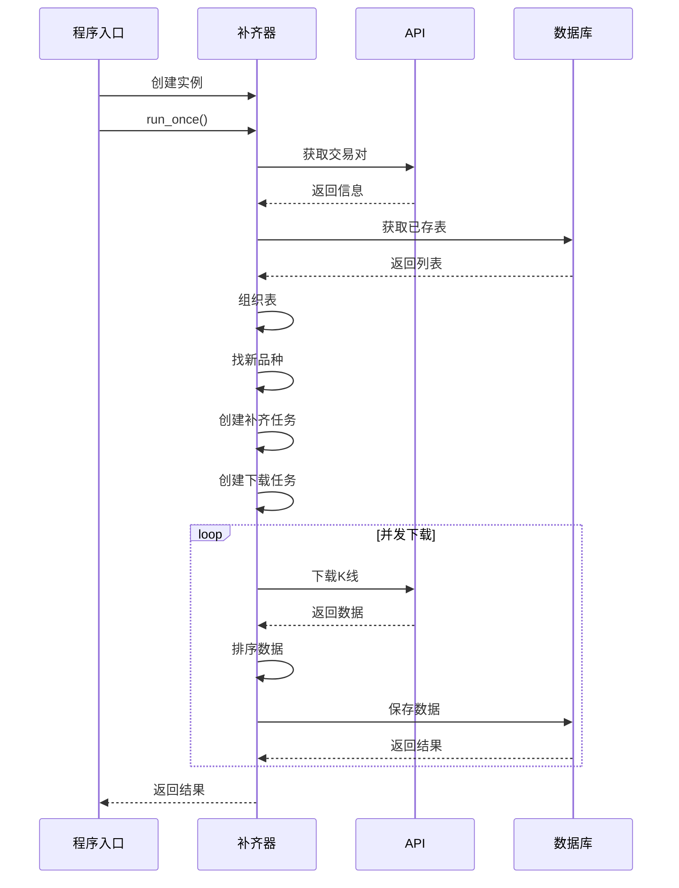
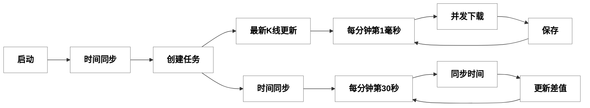
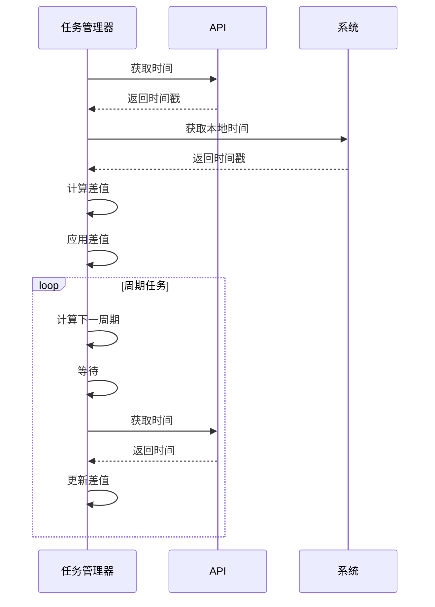
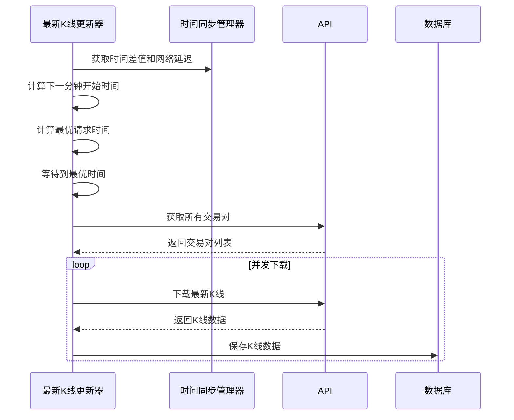

# K线数据下载与存储流程详解

本文档详细描述了从获取合约品种、对比数据库品种、下载新品种K线、补齐旧品种K线到存入数据库的完整流程。

## 1. 总体流程概览

### 第一行：获取数据和准备


### 第二行：下载任务执行

```mermaid
flowchart LR
    F-->F1["为已存在品种<br>创建补齐任务"]
    F-->F2["为新品种<br>创建完整下载任务"]7. 定时任务与并发下载
    F1-->G["并发执行<br>下载任务"]
    F2-->G
    G-->H["处理下载<br>结果"]-->I["保存数据到<br>数据库"]-->J["结束流程"]

    %% 设置所有节点样式
    classDef nodeStyle fill:#ffffff,stroke:#333,color:black,font-weight:bold,font-size:18px
    class F,F1,F2,G,H,I,J nodeStyle
```

## 2. 详细流程分解

### 2.1 获取所有U本位永续合约交易对



相关类和函数:
- `BinanceApi` 类 (src\klcommon\api.rs)
  - `new()` - 创建币安API客户端实例
  - `get_exchange_info()` - 获取交易所信息
  - `get_trading_usdt_perpetual_symbols()` - 获取交易中的U本位永续合约交易对

逻辑描述:
该模块负责从币安API获取所有正在交易的U本位永续合约交易对。首先创建一个API客户端实例，然后调用`get_exchange_info()`方法获取交易所信息，该方法会向币安API发送HTTP请求。如果请求成功，会从返回的数据中筛选出所有以USDT结尾且状态为"TRADING"的交易对，并记录获取到的交易对数量。如果请求失败，会记录错误信息但不会中断程序流程，而是返回一个空列表，以便程序可以继续执行后续步骤。这种设计确保了即使API请求失败，程序也能够优雅地处理异常情况。

### 2.2 获取数据库中已存在的K线表


相关类和函数:
- `KlineBackfiller` 类 (src\kldata\backfill.rs)
  - `get_existing_kline_tables()` - 获取已存在的K线表
  - `parse_table_name()` - 解析表名，提取品种和周期信息

逻辑描述:
该模块负责查询数据库中已存在的K线表，以便后续确定哪些交易对和周期需要下载新数据。首先连接到SQLite数据库，然后执行SQL查询获取所有以"k_"开头的表名（这是K线表的命名规则）。接着解析每个表名，从中提取出交易对和时间周期信息。表名格式为"k_symbol_interval"，例如"k_btc_1m"表示比特币1分钟K线表。最后，根据指定的周期列表过滤表，只保留需要处理的周期对应的表，并返回这些表的列表。这一步骤为后续的数据对比和下载任务创建提供了基础信息。

### 2.3 按品种和周期组织已存在的表


相关类和函数:
- `KlineBackfiller` 类 (src\kldata\backfill.rs)
  - `run_once()` - 执行一次性补齐流程

逻辑描述:
该模块将从数据库获取的K线表按照交易对和周期进行组织，以便后续处理。首先创建一个空的哈希表（HashMap），其中键为交易对名称，值为该交易对对应的周期列表。然后遍历上一步获取的所有已存在表列表，对每个表解析出交易对和周期信息，并将周期添加到对应交易对的列表中。这种组织方式使得后续可以快速查找特定交易对已有哪些周期的数据表，从而确定需要补齐哪些数据。这一步骤优化了数据结构，提高了后续处理的效率，特别是在处理大量交易对和多个时间周期时。

### 2.4 找出新增的品种




相关类和函数:
- `KlineBackfiller` 类 (src\kldata\backfill.rs)
  - `run_once()` - 执行一次性补齐流程

逻辑描述:
该模块负责识别需要新建数据表的交易对，即那些在币安API返回的交易对列表中存在，但在数据库中尚未有对应表的交易对。首先创建一个空列表用于存储新增的交易对，然后遍历从币安API获取的所有交易对。对于每个交易对，检查它是否已经存在于上一步组织好的哈希表中。如果不存在，则将其添加到新增交易对列表中；如果已存在，则跳过。这一步骤的目的是识别出需要从头开始下载历史数据的交易对，与需要仅补齐最新数据的已存在交易对区分开来，从而优化下载策略，避免不必要的数据重复下载。

### 2.5 创建下载任务

#### 2.5.1 为已存在品种创建补齐任务




相关类和函数:
- `KlineBackfiller` 类 (src\kldata\backfill.rs)
  - `run_once()` - 执行一次性补齐流程
- `Database` 类 (src\klcommon\db.rs)
  - `get_latest_kline_timestamp(symbol, interval)` - 获取最后一根K线时间戳

逻辑描述:
该模块负责为已存在于数据库中的交易对创建数据补齐任务。首先遍历所有已存在的交易对及其对应的周期，对每个组合，查询数据库获取该交易对和周期的最后一根K线的时间戳。如果成功获取到时间戳（表示表中有数据），则比较该时间戳与当前时间，判断是否需要补齐数据。只有当最后K线时间早于当前时间时，才需要创建补齐任务，任务的起始时间设置为最后一根K线后一分钟，结束时间为当前时间。如果没有获取到时间戳（表存在但没有数据），则将其视为新品种处理，创建完整下载任务。这种策略确保了只下载缺失的数据部分，避免了重复下载，提高了效率。

#### 2.5.2 为新品种创建完整下载任务


相关类和函数:
- `KlineBackfiller` 类 (src\kldata\backfill.rs)
  - `run_once()` - 执行一次性补齐流程

逻辑描述:
该模块负责为新发现的交易对创建完整的历史数据下载任务。首先遍历所有新增的交易对，对每个交易对再遍历所有需要处理的时间周期。对于每个交易对和周期组合，根据周期的不同计算适当的历史数据起始时间。例如，对于1分钟周期，下载最近1000分钟的数据；对于1周周期，下载最近200周的数据。这种差异化策略平衡了数据完整性和存储空间的需求。然后创建下载任务，指定交易对、周期、起始时间、结束时间（当前时间）和每次请求的K线数量限制（通常为1000，这是币安API的限制）。最后将任务添加到任务列表中，等待后续执行。这种方法确保了新交易对能够获取足够的历史数据，同时避免下载过多可能不需要的旧数据。

### 2.6 并发执行下载任务

#### 第一行：任务准备与执行


#### 第二行：结果处理与统计



相关类和函数:
- `KlineBackfiller` 类 (src\kldata\backfill.rs)
  - `run_once()` - 执行一次性补齐流程
- `BinanceApi` 类 (src\klcommon\api.rs)
  - `download_klines(task)` - 下载K线数据
- `Database` 类 (src\klcommon\db.rs)
  - `save_klines(symbol, interval, klines)` - 保存K线数据

逻辑描述:
该模块实现了高效的并发下载机制，用于执行前面创建的所有下载任务。首先创建一个信号量（Semaphore）来限制并发数量（通常设置为15个并发），避免过多请求导致API限制或资源耗尽。然后遍历所有下载任务，为每个任务创建一个异步任务（tokio::spawn）。每个异步任务首先获取信号量许可，确保并发数不超过限制，然后调用API下载K线数据。

如果下载成功，会对获取的K线数据按时间排序，确保数据的时间顺序正确，然后保存到数据库，并记录成功信息。如果下载失败，会记录错误信息，并将失败的任务添加到失败列表中，以便后续可能的重试。所有异步任务创建后，主线程等待所有任务完成，然后统计成功和失败的任务数量。

这种并发设计大大提高了下载效率，特别是在处理大量交易对和多个时间周期时，同时通过信号量控制避免了过度并发可能导致的问题。此外，对失败任务的记录和可能的重试机制增强了系统的健壮性。

### 2.7 保存K线数据到数据库

#### 第一行：准备与事务开始


#### 第二行：处理结果与事务提交



相关类和函数:
- `Database` 类 (src\klcommon\db.rs)
  - `save_klines(symbol, interval, klines)` - 保存K线数据
  - `ensure_symbol_table(symbol, interval)` - 确保表存在

逻辑描述:
该模块负责将下载的K线数据安全高效地保存到SQLite数据库中。首先确保目标表存在，如果不存在则创建。表名遵循"k_symbol_interval"的格式，例如"k_btc_1m"，其中symbol会去除"USDT"后缀并转为小写。然后获取数据库连接并开始一个事务，事务机制确保数据一致性，如果插入过程中出错，可以回滚所有操作。

接着遍历所有K线数据，对每条数据执行SQL插入语句，使用ON CONFLICT子句处理可能的主键冲突（基于open_time字段）。如果插入成功，计数器加1并继续处理下一条数据；如果失败，则回滚事务并返回错误。当所有数据处理完毕后，提交事务，记录成功插入的数据数量，并返回结果。

这种实现利用了SQLite的事务特性和WAL（Write-Ahead Logging）模式，提高了写入性能和数据安全性。同时，通过批量插入和事务处理，减少了数据库操作的开销，提高了整体效率。

## 3. 数据结构

### 3.1 数据结构

相关类:
- `Kline` - 定义在 src\klcommon\models.rs 中，用于存储K线数据
- `KlineData` - 定义在 src\klcommon\models.rs 中，用于处理WebSocket K线数据
- `DownloadTask` - 定义在 src\klcommon\models.rs 中，用于描述K线下载任务

逻辑描述:
系统使用了几个关键的数据结构来表示和处理K线数据。`Kline`结构体是核心数据模型，用于存储完整的K线信息，包括开盘时间、开盘价、最高价、最低价、收盘价、成交量等字段，与币安API返回的K线数据格式一致。`KlineData`结构体专门用于处理WebSocket实时K线数据，包含了判断K线是否已收盘的标志。`DownloadTask`结构体描述了一个下载任务，指定了交易对、时间周期、起始时间、结束时间和每次请求的K线数量限制。这些数据结构的设计确保了系统能够高效地表示、传输和处理K线数据，同时与币安API的数据格式保持兼容。

### 3.2 数据库表结构

每个品种和周期组合都有一个独立的表，表名格式为：`k_symbol_interval`（例如：`k_btc_1m`）

数据库使用SQLite的WAL模式和其他性能优化设置。

逻辑描述:
数据库采用了分表策略，为每个交易对和时间周期组合创建独立的表，表名遵循`k_symbol_interval`的格式。例如，比特币1分钟K线存储在`k_btc_1m`表中。每个表的主键是`open_time`字段，确保了K线数据的唯一性。表结构包含了K线的所有字段，与`Kline`结构体对应。

系统使用SQLite数据库，并启用了WAL（Write-Ahead Logging）模式，这种模式提供了更好的并发性能和崩溃恢复能力。此外，还应用了多项性能优化设置，如增加缓存大小、使用内存映射、调整同步模式等，以提高数据库的读写性能。这种分表设计和性能优化使得系统能够高效地存储和查询大量的K线数据，同时保持良好的扩展性。

## 4. 完整流程时序图



## 5. 关键点和优化

1. **并发控制**：使用信号量限制并发数，避免过多请求导致API限制或资源耗尽
2. **错误处理**：对API请求和数据库操作的错误进行捕获和记录，确保程序稳定运行
3. **事务处理**：使用数据库事务保证数据一致性，如果插入过程中出错，可以回滚
4. **数据排序**：保存前对K线数据按时间排序，确保数据的时间顺序正确
5. **表名规范**：统一的表命名规则，方便后续查询和管理
6. **周期差异化**：根据不同周期设置不同的历史数据长度，平衡数据完整性和存储空间
7. **增量更新**：对已存在品种只下载缺失的部分，避免重复下载
8. **WAL模式**：使用SQLite的WAL模式提高写入性能

## 6. 异常情况处理

1. **API请求失败**：记录错误信息
2. **数据库连接失败**：尝试重新连接或创建数据库
3. **表创建失败**：记录错误信息并向上传播
4. **数据插入冲突**：使用ON CONFLICT语句更新已存在的记录
5. **并发限制**：使用信号量控制并发数，避免请求过多被API限制
6. **空数据处理**：检查API返回的数据是否为空，避免处理空数据
7. **时间范围异常**：确保起始时间早于结束时间，避免无效请求

## 7. 定时任务与并发下载

系统实现了精确的定时任务机制，用于在特定时间点并发下载最新的K线数据。主要实现在 `src\klcommon\server_time_sync.rs` 文件中的 `ServerTimeSyncManager` 类、`src\kldata\latest_kline_updater.rs` 文件中的 `LatestKlineUpdater` 类，以及 `src\bin\kline_data_service.rs` 中的启动逻辑。

### 7.1 定时任务设计



相关类和函数:
- `ServerTimeSyncManager` 类 (src\klcommon\server_time_sync.rs)
  - `new()` - 创建新的服务器时间同步管理器
  - `start()` - 启动时间同步任务
- `LatestKlineUpdater` 类 (src\kldata\latest_kline_updater.rs)
  - `new(db, intervals, time_sync_manager, concurrency)` - 创建新的最新K线更新器
  - `start()` - 启动最新K线更新任务

逻辑描述:
系统的定时任务设计分为两个主要部分：服务器时间同步和最新K线更新。

首先，程序启动时会创建并启动`ServerTimeSyncManager`实例，该管理器负责与币安服务器进行时间同步，计算本地时间与服务器时间的差值，并定期更新这个差值。时间同步任务设置为每分钟的第30秒运行，确保系统始终有准确的时间参考。

然后，程序会创建并启动`LatestKlineUpdater`实例，该更新器负责在每分钟的第1毫秒开始，并发下载所有品种、所有周期的最新一根K线。这个功能解决了WebSocket合成K线与币安官方K线可能产生的偏移问题，确保系统中的K线数据与币安官方数据保持一致。

### 7.2 时间同步机制



相关类和函数:
- `ServerTimeSyncManager` 类 (src\klcommon\server_time_sync.rs)
  - `start()` - 启动定时任务
  - `sync_time_once()` - 执行一次时间同步
  - `start_time_sync_task()` - 启动独立的时间同步任务
  - `calculate_optimal_request_time()` - 计算最优请求发送时间
- `BinanceApi` 类 (src\klcommon\api.rs)
  - `get_server_time()` - 获取币安服务器时间
- `ServerTime` 类 (src\klcommon\models.rs)
  - 用于存储币安服务器时间

逻辑描述:
时间同步机制是系统精确控制定时任务的关键。`ServerTimeSyncManager`首先通过`sync_time_once()`方法执行一次初始时间同步，记录开始时间，然后调用币安API获取服务器时间。通过比较本地时间和服务器时间，计算出时间差值，同时测量网络延迟（往返时间的一半）。这些值被存储在原子变量中，可以被系统的其他部分安全地访问。

之后，通过`start_time_sync_task()`方法启动一个独立的定时同步任务，该任务在每分钟的第30秒运行，重复执行时间同步过程，并更新时间差值和网络延迟。这种设计确保了系统始终有准确的时间参考，即使在网络延迟变化或本地时钟漂移的情况下也能保持准确。

系统还提供了`calculate_optimal_request_time()`方法，用于计算最优的请求发送时间，考虑了时间差值、网络延迟和安全边际，确保请求能够在目标时间点（如每分钟的第1毫秒）到达服务器。这个功能被最新K线更新器用来精确控制下载时机。

### 7.3 最新K线更新实现



相关类和函数:
- `LatestKlineUpdater` 类 (src\kldata\latest_kline_updater.rs)
  - `start()` - 启动最新K线更新任务
  - `update_latest_klines()` - 更新所有品种、所有周期的最新一根K线
  - `calculate_next_minute_start()` - 计算下一分钟的开始时间
- `BinanceApi` 类 (src\klcommon\api.rs)
  - `get_trading_usdt_perpetual_symbols()` - 获取交易中的U本位永续合约交易对
  - `download_klines(task)` - 下载K线数据
- `Database` 类 (src\klcommon\db.rs)
  - `save_klines(symbol, interval, klines)` - 保存K线数据

逻辑描述:
最新K线更新是系统的一个重要功能，由`LatestKlineUpdater`类实现。该类的`start()`方法创建一个无限循环，在每次循环中，首先计算下一分钟的开始时间（考虑时间差值和网络延迟），然后等待到该时间点，接着执行一次更新操作。

更新过程中，系统首先获取所有正在交易的U本位永续合约交易对，然后为每个交易对和周期组合创建一个下载任务。每个任务只下载最新的一根K线（limit=1），起始时间设置为当前时间减去一个周期，确保能获取到最新的一根K线。

系统使用高并发（默认100个并发）下载所有任务，通过信号量控制并发数量，避免过多请求导致API限制或资源耗尽。下载完成后，将K线数据保存到数据库，供后续查询和显示。

这个功能解决了WebSocket合成K线与币安官方K线可能产生的偏移问题，确保系统中的K线数据与币安官方数据保持一致。每分钟更新一次，在每分钟的第1毫秒开始，确保能够获取到最新的K线数据。

## 8. 主程序入口

相关文件和函数:
- `src\bin\kline_data_service.rs`
  - `main()` - 程序入口点

逻辑描述:
主程序入口位于`src\bin\kline_data_service.rs`文件的`main()`函数，它是整个系统的启动点。该函数首先初始化日志系统，设置适当的日志级别和格式。然后创建SQLite数据库连接，使用WAL模式和其他性能优化设置。接着创建并启动服务器时间同步管理器，执行一次初始时间同步，并在后台启动定时同步任务。

如果不是仅流模式（stream_only=false），程序会创建K线补齐器实例，执行一次性补齐流程，下载并保存缺失的历史K线数据。然后获取所有交易对，并启动最新K线更新任务，该任务在每分钟的第1毫秒开始，并发下载所有品种、所有周期的最新一根K线。

最后，程序设置HTTP代理环境变量，创建并启动连续合约K线客户端，用于通过WebSocket接收实时K线更新。这种模块化的设计使得系统各部分职责明确，易于维护和扩展。整个启动流程确保了数据的完整性和实时性，同时优化了资源使用和性能。

## 9. 总结

本文档详细描述了从获取合约品种到存入数据库的完整流程，包括获取交易对、对比数据库品种、创建下载任务、并发下载和保存数据等步骤，以及定时任务与并发下载机制。通过这一流程，系统能够高效地获取和更新币安U本位永续合约的K线数据，为后续的数据分析和交易策略提供基础。

系统的设计遵循了模块化和关注点分离的原则，将不同功能划分为独立的模块，如数据下载、数据库操作、时间同步等。这种设计使得系统易于维护和扩展，同时通过并发处理、事务管理、WAL模式等技术优化了性能。

系统实现了双重保障机制，通过WebSocket实时接收K线更新，同时每分钟下载一次最新K线，解决了WebSocket合成K线与币安官方K线可能产生的偏移问题，确保系统中的K线数据与币安官方数据保持一致。

系统还实现了健壮的错误处理机制，能够应对API请求失败、数据库连接问题等异常情况，确保程序的稳定运行。通过精确的时间同步和定时任务控制，系统能够在正确的时间点执行数据下载和处理操作，提高了数据的准确性和实时性。

主要文件和类：
- `src\bin\kline_data_service.rs`: 主程序入口
- `src\kldata\backfill.rs`: `KlineBackfiller` 类，负责历史数据补齐
- `src\kldata\latest_kline_updater.rs`: `LatestKlineUpdater` 类，负责每分钟更新最新K线
- `src\klcommon\server_time_sync.rs`: `ServerTimeSyncManager` 类，负责服务器时间同步
- `src\klcommon\api.rs`: `BinanceApi` 类，负责与币安API交互
- `src\klcommon\db.rs`: `Database` 类，负责数据库操作
- `src\klcommon\websocket.rs`: `ContinuousKlineClient` 类，负责WebSocket连接和实时数据接收
- `src\klcommon\models.rs`: `Kline`, `KlineData`, `DownloadTask`, `ServerTime` 等数据模型
