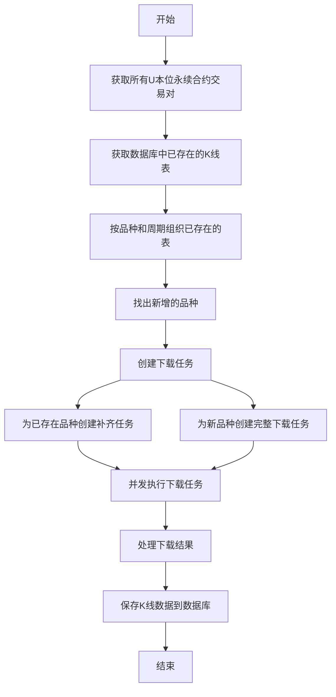
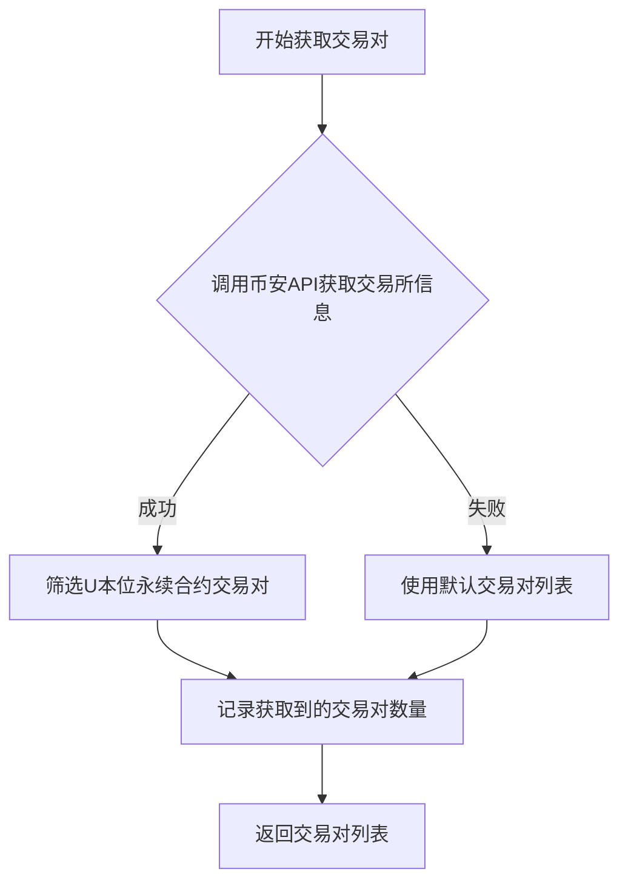
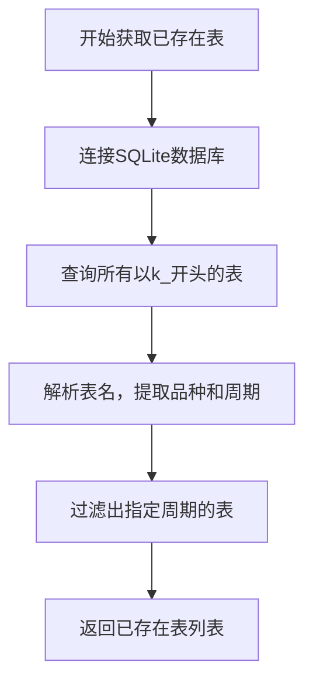
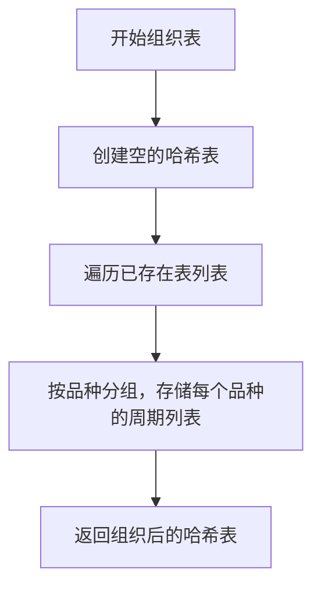
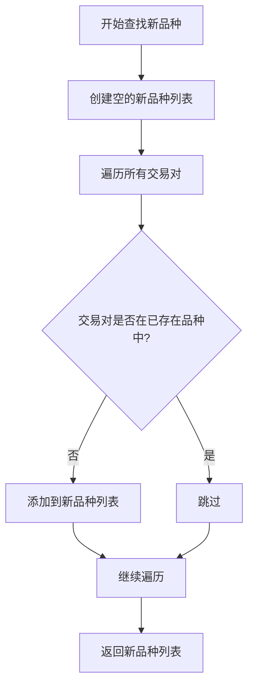
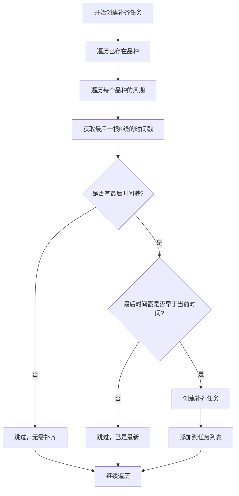
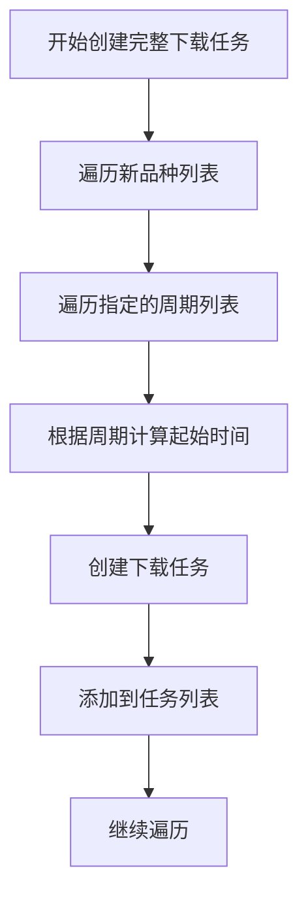
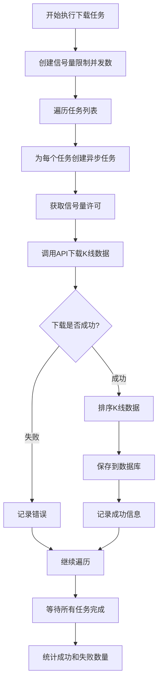
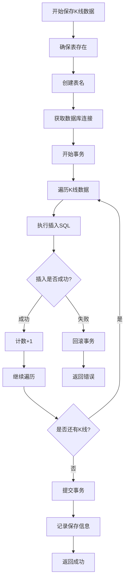
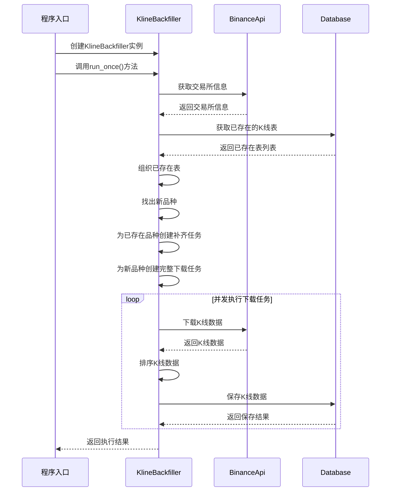

# K线数据下载与存储流程详解

本文档详细描述了从获取合约品种、对比数据库品种、下载新品种K线、补齐旧品种K线到存入数据库的完整流程。

## 1. 总体流程概览



## 2. 详细流程分解

### 2.1 获取所有U本位永续合约交易对



详细步骤：
1. 创建币安API客户端实例
2. 调用`get_exchange_info()`方法获取交易所信息
3. 从返回的交易所信息中筛选出所有以"USDT"结尾且状态为"TRADING"的交易对
4. 如果API调用失败，则使用默认交易对列表（包含主要币种如BTC、ETH等）
5. 记录获取到的交易对数量
6. 返回交易对列表供后续处理

### 2.2 获取数据库中已存在的K线表



详细步骤：
1. 获取数据库连接
2. 执行SQL查询：`SELECT name FROM sqlite_master WHERE type='table' AND name LIKE 'k_%'`
3. 解析每个表名，提取品种和周期信息
   - 表名格式为：`k_symbol_interval`（例如：`k_btc_1m`）
   - 从表名中提取品种时，会添加"USDT"后缀（例如：`btc` -> `BTCUSDT`）
4. 过滤出指定周期的表（如1m、5m、30m、4h、1d、1w）
5. 返回已存在表列表，格式为：`[(symbol, interval), ...]`

### 2.3 按品种和周期组织已存在的表



详细步骤：
1. 创建一个空的哈希表`existing_symbol_intervals`
2. 遍历已存在表列表中的每个(symbol, interval)对
3. 将interval添加到对应symbol的周期列表中
4. 返回组织后的哈希表，格式为：`{symbol: [interval1, interval2, ...], ...}`

### 2.4 找出新增的品种



详细步骤：
1. 创建一个空的新品种列表`new_symbols`
2. 遍历从币安API获取的所有交易对
3. 检查每个交易对是否已存在于数据库中（通过查找`existing_symbol_intervals`哈希表）
4. 如果交易对不存在于数据库中，则添加到新品种列表
5. 返回新品种列表，包含所有需要下载完整历史数据的品种

### 2.5 创建下载任务

#### 2.5.1 为已存在品种创建补齐任务



详细步骤：
1. 遍历已存在品种哈希表中的每个(symbol, intervals)对
2. 对于每个品种的每个周期，获取该品种该周期的最后一根K线时间戳
3. 如果存在最后时间戳：
   - 计算从最后时间戳到当前时间需要补齐的数据
   - 如果最后时间戳早于当前时间，则创建补齐任务
   - 补齐任务的起始时间为最后一根K线后一分钟（last_timestamp + 60000）
   - 补齐任务的结束时间为当前时间
4. 如果不存在最后时间戳或最后时间戳已是最新，则跳过该品种该周期
5. 将创建的补齐任务添加到任务列表中

#### 2.5.2 为新品种创建完整下载任务



详细步骤：
1. 遍历新品种列表中的每个symbol
2. 对于每个品种，遍历指定的周期列表（1m、5m、30m、4h、1d、1w）
3. 根据不同周期计算起始时间：
   - 1m：当前时间 - 1000分钟
   - 5m：当前时间 - 5000分钟
   - 30m：当前时间 - 30000分钟
   - 4h：当前时间 - 4000小时
   - 1d：当前时间 - 1000天
   - 1w：当前时间 - 200周
4. 创建下载任务，包含品种、周期、起始时间、结束时间（当前时间）和限制数量（1000）
5. 将创建的下载任务添加到任务列表中

### 2.6 并发执行下载任务



详细步骤：
1. 创建信号量限制并发数（默认为15）
2. 遍历任务列表中的每个下载任务
3. 为每个任务创建一个异步任务：
   - 获取信号量许可，确保并发数不超过限制
   - 调用币安API下载K线数据
   - 如果下载成功：
     - 按时间排序K线数据
     - 保存到数据库
     - 记录成功信息
   - 如果下载失败：
     - 记录错误信息
4. 等待所有异步任务完成
5. 统计成功和失败的任务数量

### 2.7 保存K线数据到数据库



详细步骤：
1. 确保表存在（如果不存在则创建）
2. 创建表名：`k_symbol_interval`（例如：`k_btc_1m`）
   - 将品种名转为小写并移除"USDT"后缀
   - 将周期转为小写
   - 添加"k_"前缀
3. 获取数据库连接
4. 开始事务
5. 遍历K线数据：
   - 执行插入SQL，使用ON CONFLICT语句处理冲突（更新已存在的记录）
   - 如果插入成功，计数+1
   - 如果插入失败，回滚事务并返回错误
6. 提交事务
7. 记录保存信息（保存了多少条K线数据）
8. 返回成功

## 3. 数据结构

### 3.1 K线数据结构

```
Kline {
    open_time: i64,            // K线开盘时间（毫秒时间戳）
    open: String,              // 开盘价
    high: String,              // 最高价
    low: String,               // 最低价
    close: String,             // 收盘价
    volume: String,            // 成交量
    close_time: i64,           // K线收盘时间（毫秒时间戳）
    quote_asset_volume: String, // 报价资产成交量
    number_of_trades: i64,     // 成交笔数
    taker_buy_base_asset_volume: String, // 主动买入基础资产成交量
    taker_buy_quote_asset_volume: String, // 主动买入报价资产成交量
    ignore: String             // 忽略字段
}
```

### 3.2 下载任务结构

```
DownloadTask {
    symbol: String,           // 交易对名称
    interval: String,         // K线周期
    start_time: Option<i64>,  // 起始时间（可选）
    end_time: Option<i64>,    // 结束时间（可选）
    limit: usize              // 每次请求的K线数量
}
```

### 3.3 数据库表结构

每个品种和周期组合都有一个独立的表，表名格式为：`k_symbol_interval`（例如：`k_btc_1m`）

```sql
CREATE TABLE IF NOT EXISTS k_symbol_interval (
    open_time INTEGER PRIMARY KEY,
    open TEXT NOT NULL,
    high TEXT NOT NULL,
    low TEXT NOT NULL,
    close TEXT NOT NULL,
    volume TEXT NOT NULL,
    close_time INTEGER NOT NULL,
    quote_asset_volume TEXT NOT NULL,
    number_of_trades INTEGER NOT NULL,
    taker_buy_base_asset_volume TEXT NOT NULL,
    taker_buy_quote_asset_volume TEXT NOT NULL,
    ignore TEXT,
    created_at TIMESTAMP DEFAULT CURRENT_TIMESTAMP
)
```

## 4. 完整流程时序图



## 5. 关键点和优化

1. **并发控制**：使用信号量限制并发数，避免过多请求导致API限制或资源耗尽
2. **错误处理**：对API请求和数据库操作的错误进行捕获和记录，确保程序稳定运行
3. **事务处理**：使用数据库事务保证数据一致性，如果插入过程中出错，可以回滚
4. **数据排序**：保存前对K线数据按时间排序，确保数据的时间顺序正确
5. **表名规范**：统一的表命名规则，方便后续查询和管理
6. **周期差异化**：根据不同周期设置不同的历史数据长度，平衡数据完整性和存储空间
7. **增量更新**：对已存在品种只下载缺失的部分，避免重复下载
8. **WAL模式**：使用SQLite的WAL模式提高写入性能

## 6. 异常情况处理

1. **API请求失败**：记录错误并使用默认值或跳过该任务
2. **数据库连接失败**：尝试重新连接或创建数据库
3. **表创建失败**：记录错误并尝试使用不同的表名
4. **数据插入冲突**：使用ON CONFLICT语句更新已存在的记录
5. **并发限制**：使用信号量控制并发数，避免请求过多被API限制
6. **空数据处理**：检查API返回的数据是否为空，避免处理空数据
7. **时间范围异常**：确保起始时间早于结束时间，避免无效请求

## 7. 总结

本文档详细描述了从获取合约品种到存入数据库的完整流程，包括获取交易对、对比数据库品种、创建下载任务、并发下载和保存数据等步骤。通过这一流程，系统能够高效地获取和更新币安U本位永续合约的K线数据，为后续的数据分析和交易策略提供基础。
