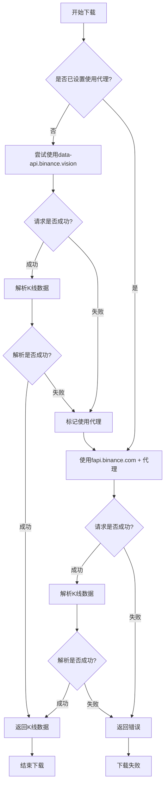
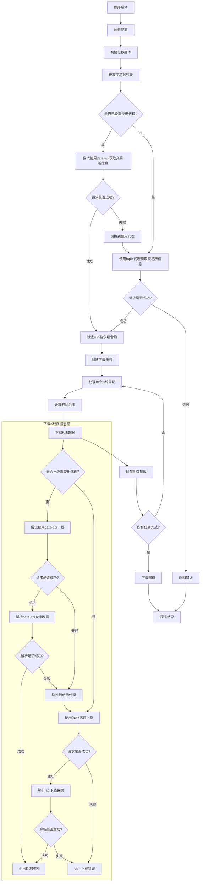
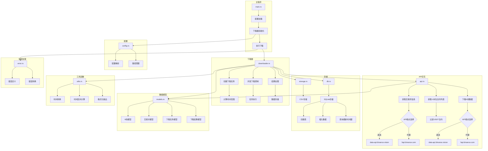

# K线下载器流程图文档

本文档包含三个流程图，分别展示了K线下载功能的不同方面：
1. K线下载功能流程图 - 单个下载请求的处理流程
2. K线下载器整体流程图 - 从启动到完成的完整流程
3. K线下载器架构图 - 各组件之间的关系和交互

## 1. K线下载功能流程图

该流程图展示了单个K线下载请求的处理流程，重点说明自动切换API端点的机制。

### 详细流程说明

1. **开始下载**：启动K线数据下载过程
2. **检查代理设置**：检查是否已经设置为使用代理模式
   - 如果未设置代理模式，尝试使用`data-api.binance.vision`端点
   - 如果已设置代理模式，直接使用`fapi.binance.com`端点和代理
3. **使用data-api端点**：
   - 构建API请求URL
   - 发送请求到`data-api.binance.vision`
   - 检查请求是否成功
4. **处理data-api响应**：
   - 如果请求成功，尝试解析K线数据
   - 如果请求失败，标记使用代理模式，并切换到`fapi.binance.com`
5. **解析data-api数据**：
   - 如果解析成功，返回K线数据
   - 如果解析失败，标记使用代理模式，并切换到`fapi.binance.com`
6. **使用fapi端点**：
   - 构建API请求URL
   - 通过代理发送请求到`fapi.binance.com`
   - 检查请求是否成功
7. **处理fapi响应**：
   - 如果请求成功，尝试解析K线数据
   - 如果请求失败，返回错误
8. **解析fapi数据**：
   - 如果解析成功，返回K线数据
   - 如果解析失败，返回错误
9. **完成下载**：下载过程结束，返回结果

## 2. K线下载器整体流程图

该流程图展示了从程序启动到完成的整个下载过程。

### 整体下载流程说明

#### 1. 初始化阶段
- **程序启动**：启动K线下载器程序
- **加载配置**：加载硬编码的配置参数（起始时间为2025年4月8日）
- **初始化数据库**：设置SQLite数据库连接
- **获取交易对列表**：从币安API获取可用的交易对列表

#### 2. 获取交易对列表
- **检查代理设置**：检查是否已设置为使用代理模式
- **尝试使用data-api**：首先尝试从`data-api.binance.vision`获取交易所信息
- **切换到fapi+代理**：如果data-api失败，切换到使用代理的`fapi.binance.com`
- **过滤U本位永续合约**：从交易所信息中过滤出U本位永续合约（以USDT结尾且状态为TRADING）

#### 3. 创建下载任务
- **创建下载任务**：为每个交易对和K线周期创建下载任务
- **处理每个K线周期**：依次处理1分钟和5分钟周期
- **计算时间范围**：计算从2025年4月8日到当前时间的时间范围

#### 4. 下载K线数据
- **下载K线数据**：使用自动切换机制下载K线数据
  - 首先尝试使用`data-api.binance.vision`
  - 如果失败，切换到使用代理的`fapi.binance.com`
- **保存到数据库**：将下载的K线数据保存到SQLite数据库
- **检查任务完成情况**：检查是否所有下载任务都已完成

#### 5. 完成下载
- **下载完成**：所有K线数据下载完成
- **程序结束**：下载器程序结束运行

## 3. K线下载器架构图

该流程图展示了下载器各个组件之间的关系和交互。

### 架构组件说明

#### 1. 主程序 (main.rs)
- **配置加载**：加载硬编码的配置参数
- **下载器初始化**：初始化下载器组件
- **执行下载**：启动下载过程

#### 2. API交互 (api.rs)
- **获取交易所信息**：从币安API获取交易所信息
- **获取U本位合约列表**：获取并过滤U本位永续合约
- **下载K线数据**：从API下载K线数据
- **API端点选择**：自动在`data-api.binance.vision`和`fapi.binance.com`之间切换

#### 3. 下载器 (downloader.rs)
- **创建下载任务**：为每个交易对和周期创建下载任务
- **并发下载控制**：控制并发下载数量
- **结果处理**：处理下载结果
- **计算时间范围**：计算从2025年4月8日到当前时间的时间范围
- **任务执行**：执行下载任务
- **数据存储**：将下载的数据存储到数据库

#### 4. 存储 (storage.rs, db.rs)
- **CSV存储**：将K线数据存储为CSV格式（可选）
- **SQLite存储**：将K线数据存储到SQLite数据库
- **创建表**：为每个交易对和周期创建数据表
- **插入数据**：将K线数据插入数据库
- **查询最新时间戳**：查询数据库中最新的K线时间戳

#### 5. 数据模型 (models.rs)
- **K线模型**：定义K线数据结构
- **交易对模型**：定义交易对信息结构
- **下载任务模型**：定义下载任务结构
- **下载结果模型**：定义下载结果结构

#### 6. 工具函数 (utils.rs)
- **时间转换**：在不同时间格式之间转换
- **时间区间计算**：计算下载时间区间
- **格式化输出**：格式化日志输出

#### 7. 配置 (config.rs)
- **配置解析**：解析配置参数
- **路径管理**：管理输出路径

#### 8. 错误处理 (error.rs)
- **错误定义**：定义应用程序错误类型
- **错误转换**：在不同错误类型之间转换

## 自动切换机制的实现与优势

### 实现方式
自动切换机制主要在**API交互**组件中实现，通过以下步骤：

1. 使用`AtomicBool`记录当前是否使用代理
2. 默认情况下先尝试使用`data-api.binance.vision`端点
3. 如果请求失败或数据解析错误，将`AtomicBool`设置为`true`
4. 后续请求将使用`fapi.binance.com`端点和代理
5. 所有API请求共享同一个`AtomicBool`，确保一旦切换就对所有请求生效

### 优势
1. **高可用性**：即使一个API端点不可用，也能通过另一个端点获取数据
2. **无需手动干预**：自动检测并切换API端点，无需用户手动配置
3. **适应不同网络环境**：在不同网络环境下都能找到可用的API端点
4. **详细日志记录**：记录切换过程，便于排查问题
5. **状态记忆**：使用原子布尔值记住当前使用的端点，避免重复尝试已知失败的端点
