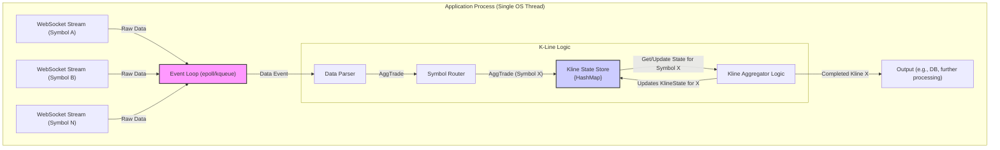
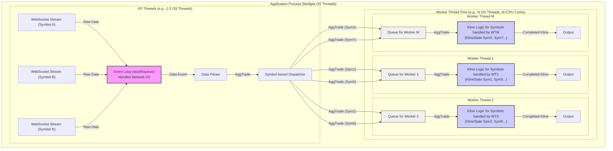
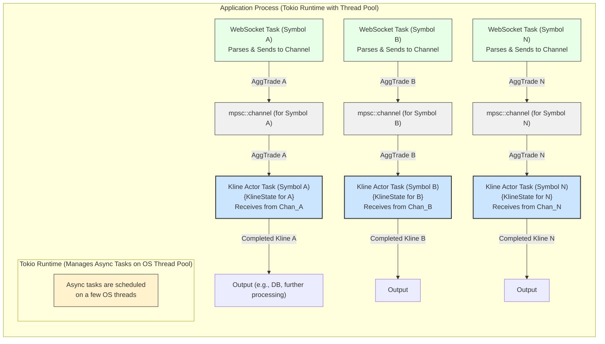

# 高频数据K线合成方案对比：C/C++ vs Rust (Tokio)

本文档对比了在 C/C++ 和 Rust (使用 Tokio) 中处理高频交易数据并合成K线的常见实现结构。主要关注的是如何从多个并发的 WebSocket 数据流（每个流代表一个合约品种的归集交易）高效地聚合成K线数据。

## 图例说明

在以下的 Mermaid 图表中，使用了以下符号：

*   `--->` : 数据流或消息传递
*   `WebSocket Stream (Symbol A)`: 代表来自特定合约品种的 WebSocket 数据流
*   `AggTrade`: 归集交易数据
*   `Kline`: K 线数据
*   `{State}`: 表示该组件维护着状态 (例如 K 线状态)
*   `Queue`: 消息队列
*   `Event Loop`: 事件循环 (如 epoll, kqueue)
*   `Async Task`: Rust 中的异步任务 (`tokio::spawn`)
*   `OS Thread`: 操作系统线程

## 模式 1: C/C++ - 单线程事件循环 (Reactor)

这种模式通常用于相对简单或对极致低延迟（牺牲部分并发性）有要求的场景。

## 说明 (模式 1 - C/C++ 单线程 Reactor)

* **单一 OS 线程**： 整个应用（或至少是数据处理核心）运行在单个 OS 线程中。

* **事件循环**： 核心是事件循环（如 epoll）。它监控所有 WebSocket 连接的 I/O 事件。

* **顺序处理**： 当数据到达时，事件循环唤醒，数据被解析、路由，然后 K 线状态被更新。所有操作都在同一个线程中顺序执行。

* **状态管理**： 所有合约的 K 线状态通常存储在一个集中的数据结构中（如 HashMap）。由于是单线程，访问此结构不需要锁。

* **优点**： 实现相对简单，无线程同步开销。

* **缺点**： 无法利用多核 CPU，高负载下会成为系统的性能瓶颈。

## 模式 2: C/C++ - I/O 线程 + Worker 线程池

这是一种更常见的高性能设计，旨在充分利用多核CPU。

## 说明 (模式 2 - C/C++ I/O + Worker 线程池)

* **分离 I/O 和计算**：
  * 少数 I/O 线程专门负责网络数据接收和初步解析。
  * 工作线程池 (Worker Threads) 负责 K 线合成计算。

* **数据分发**： Dispatcher 根据合约品种（通常通过哈希）将 AggTrade 数据发送到对应的工作线程的队列中。

* **状态隔离**： 每个工作线程负责处理一部分合约品种，并维护这些品种的 K 线状态。由于每个合约的状态只被一个特定线程访问，因此在该线程内部通常不需要锁。

* **队列**： I/O 线程和工作线程之间通过线程安全的队列 (MPSC - Multi-Producer, Single-Consumer queues 是常见的选择) 通信。

* **优点**： 能够充分利用多核 CPU，提高吞吐量。

* **缺点**： 实现更复杂，需要仔细处理线程同步和队列管理，内存安全需要开发者保障。

## 模式 3: Rust - Tokio Actor-like (Async Tasks & Channels)

Rust 利用其 async/await 语法和 Tokio 运行时，可以实现一种与 C/C++ 模式 2 思想类似但抽象层次更高的 Actor 式并发模型。

## 说明 (模式 3 - Rust Tokio Actor-like)

* **异步任务 (async Task)**:
  * 每个 WebSocket 连接可以有一个专门的异步任务 (WS_X_Task)，负责读取数据、解析，然后将 AggTrade 发送到对应合约品种的 Channel。
  * 每个合约品种有一个专门的 K 线处理异步任务 (Actor_X)，它拥有该合约的 K 线状态。

* **Channels (mpsc::channel)**: AggTrade 数据通过异步 Channel 从 WebSocket 任务传递给 K 线 Actor 任务。

* **Tokio 运行时**： Tokio 运行时管理这些大量的、轻量级的异步任务，并将它们调度到其内部的 OS 线程池上执行。当任务等待 I/O (如从 Channel 接收消息) 时，它不会阻塞 OS 线程。

* **状态隔离**： 每个 Actor_X 任务独立维护其合约的 KlineState。由于每个状态只被一个异步任务访问（消息是顺序处理的），因此不需要额外的锁。

* **优点**： 利用 Rust 的 async/await 语法和所有权系统，代码更易于编写和理解并发逻辑，并能获得编译时的内存安全保证。高效利用多核。

* **缺点**： 仍然有异步编程的心智模型需要适应。与C++模式2相比，抽象程度更高，可能在某些极端情况下的底层控制力稍弱，但通常性能优异且开发效率和安全性更高。

## 总结

C/C++ 的高性能方案（模式 2）和 Rust 的 Tokio Actor 式方案（模式 3）在核心并发策略上非常相似：通过将工作负载（不同合约的数据）分配给独立的处理单元（线程/异步任务），并使用消息传递（队列/Channel）进行通信，来实现状态隔离和并行处理。

主要区别在于：

* **内存安全**： Rust 提供编译时保证，C/C++ 依赖开发者。
* **并发抽象**： Rust 的 async/await 和 Tokio 提供了更现代和易用的并发工具。
* **开发复杂度和维护性**： Rust 通常能以更少的代码量和更高的安全性实现复杂并发逻辑。

对于处理类似您描述的500个合约品种的归集交易数据并合成K线的场景，Rust 的 Tokio Actor 式方案（模式 3）是一个非常强大且高效的选择，它结合了高性能和高安全性的优点。