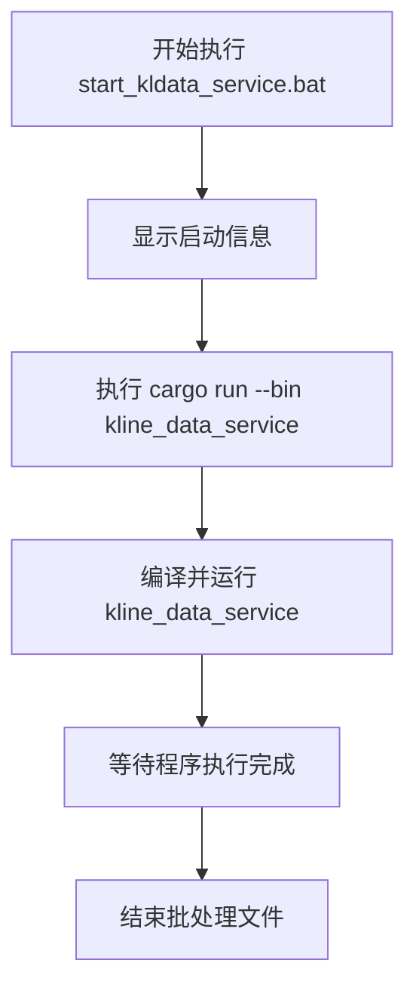
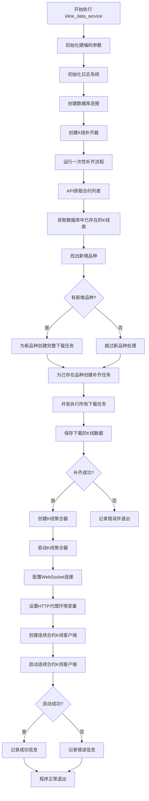
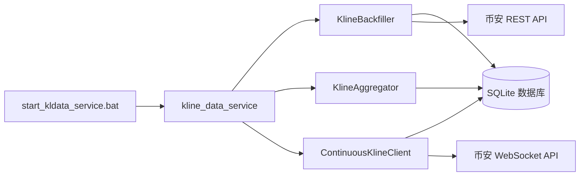
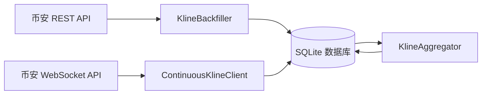
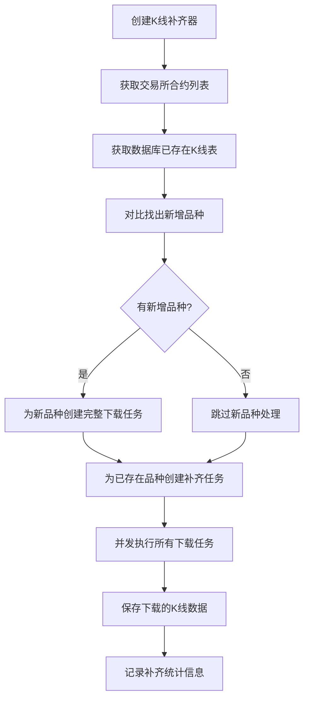

# start_kldata_service.bat 执行流程图

本文档描述了 `start_kldata_service.bat` 批处理文件的执行流程，以及它如何启动和运行 K 线数据服务。

## 批处理文件执行流程



## K线数据服务执行流程



## 详细流程说明

### 1. 批处理文件执行

1. 执行 `start_kldata_service.bat`
2. 显示启动信息
3. 执行 `cargo run --bin kline_data_service` 命令
4. Cargo 编译并运行 K 线数据服务程序
5. 等待程序执行完成
6. 批处理文件执行结束

### 2. K线数据服务执行

1. **初始化阶段**
   - 设置硬编码参数（时间周期、并发数等）
   - 初始化日志系统（设置日志级别和错误追踪）
   - 创建 SQLite 数据库连接

2. **K线数据补齐阶段**
   - 创建K线补齐器实例
   - 运行一次性补齐流程
     - 从币安API获取交易所信息和所有U本位永续合约列表
     - 获取数据库中所有已存在的K线表
     - 按品种和周期组织已存在的表
     - 找出新增的品种（在交易所列表中但不在数据库中）
     - 为新增品种创建完整下载任务：
       - 根据周期不同设置不同的历史长度（例如1m周期下载1000分钟，1w周期下载200周）
       - 为每个新品种的6个周期创建下载任务
     - 为已存在品种创建补齐任务：
       - 获取每个品种每个周期的最后一根K线时间戳
       - 计算从最后时间戳到当前时间需要补充的数据
       - 创建下载任务，只下载缺失的部分
     - 使用信号量控制并发（默认15个并发）执行所有下载任务
     - 将下载的K线数据保存到数据库
     - 记录补齐结果统计信息（成功数量、失败数量、耗时等）

3. **实时数据处理阶段**
   - 创建 K 线聚合器
   - 在后台线程启动 K 线聚合器
   - 配置 WebSocket 连接（使用代理）
   - 设置 HTTP 代理环境变量
   - 创建连续合约 K 线客户端
   - 启动连续合约 K 线客户端
     - 建立 WebSocket 连接
     - 订阅 1 分钟 K 线数据流
     - 处理实时 K 线数据
     - 更新数据库

4. **程序退出**
   - 记录执行结果
   - 正常退出或错误退出

## 关键组件交互



## 数据流向



## 代理设置

K 线数据服务使用硬编码的代理设置（127.0.0.1:1080）来访问币安 API。代理设置应用于：

1. REST API 请求（用于下载历史数据）
2. WebSocket 连接（用于接收实时数据）

代理设置通过以下方式应用：

1. 在 `BinanceApi` 类中直接配置 HTTP 客户端
2. 在 `ContinuousKlineClient` 中配置 WebSocket 连接
3. 设置环境变量以兼容其他可能使用环境变量的组件

## WebSocket连接格式

合约K线WebSocket连接使用以下格式：

```
wss://fstream.binance.com/ws/<pair>_<contractType>@continuousKline_<interval>
```

例如，订阅BTCUSDT永续合约的1分钟K线：

```
wss://fstream.binance.com/ws/btcusdt_perpetual@continuousKline_1m
```

对于组合流订阅，使用以下格式：

```
wss://fstream.binance.com/stream?streams=<pair1>_<contractType>@continuousKline_<interval1>/<pair2>_<contractType>@continuousKline_<interval2>
```

例如，同时订阅BTCUSDT和ETHUSDT永续合约的1分钟K线：

```
wss://fstream.binance.com/stream?streams=btcusdt_perpetual@continuousKline_1m/ethusdt_perpetual@continuousKline_1m
```

## 完整数据处理流程

以下是完整的K线数据处理流程，这是一个固定的流程，没有“是否仅为流模式”的判断：

1. **API获取合约列表**
   - 从币安API获取交易所信息和所有U本位永续合约列表

2. **K线数据补齐处理**
   - 获取数据库中所有已存在的K线表
   - 找出新增的品种（在交易所列表中但不在数据库中）
   - 对于新增品种：
     - 根据周期不同设置不同的历史长度下载完整历史数据
     - 1m周期下载1000分钟，5m周期下载5000分钟，以此类推
   - 对于已存在品种：
     - 获取每个品种每个周期的最后一根K线时间戳
     - 只下载从最后时间戳到当前时间的缺失数据
   - 使用信号量控制并发（默认15个并发）执行所有下载任务

3. **实时数据处理**
   - K线补齐完成后，使用WebSocket高频更新该品种的1分钟周期的K线数据
   - 程序一定会进入这个WebSocket流模式，没有“仅下载”的选项

4. **数据聚合**
   - 使用1分钟周期的实时数据，在本地合成其他5个周期（5m, 30m, 4h, 1d, 1w）
   - 每秒计算一次聚合

## 时间周期处理

K 线数据服务处理多个时间周期的数据：

1. 下载所有时间周期（1m, 5m, 30m, 4h, 1d, 1w）的历史数据
2. 实时只订阅 1 分钟周期的 K 线数据
3. 使用 K 线聚合器在本地合成其他时间周期（5m, 30m, 4h, 1d, 1w）的数据

## K线补齐器工作原理



### 补齐器优势

1. **智能补齐**：只下载真正缺失的数据，避免重复下载
2. **处理新品种**：自动识别并下载新上市的合约品种
3. **高效并发**：使用信号量控制并发数，提高下载效率
4. **自适应**：根据不同周期设置不同的历史数据长度
5. **一次性执行**：补齐操作只在程序启动时执行一次，避免重复操作
