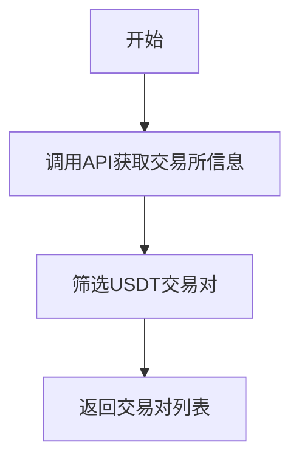
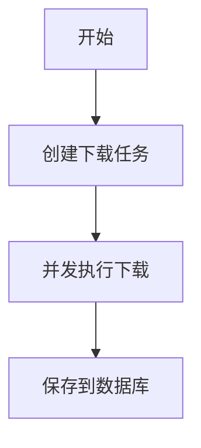
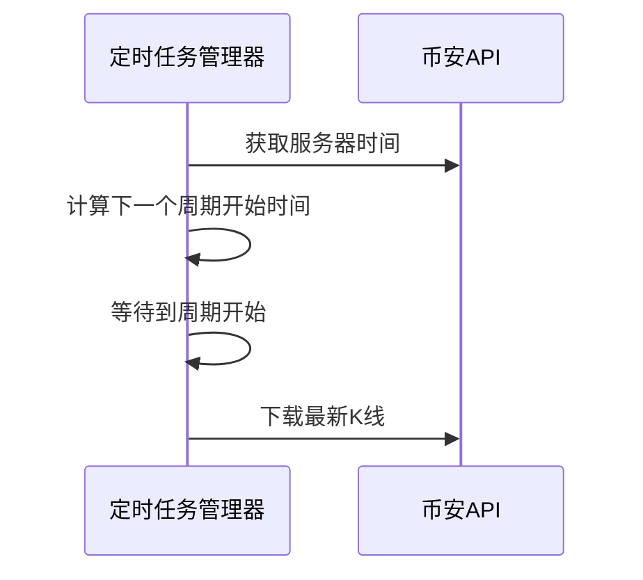

# K线数据下载流程示例（极简版）

## 1. 获取交易对流程



**实现细节：**
- 文件：`src\klcommon\api.rs`
- 函数：`get_trading_usdt_perpetual_symbols()`
- 关键代码：
  ```rust
  // 获取交易所信息
  let exchange_info = self.get_exchange_info().await?;
  
  // 筛选USDT交易对
  for symbol_info in &exchange_info.symbols {
      if symbol_info.symbol.ends_with("USDT") && symbol_info.status == "TRADING" {
          symbols.push(symbol_info.symbol.clone());
      }
  }
  ```

## 2. 下载K线数据流程



**实现细节：**
- 文件：`src\kldata\backfill.rs`
- 函数：`run_once()`
- 关键代码：
  ```rust
  // 创建下载任务
  let task = DownloadTask {
      symbol: symbol.clone(),
      interval: interval.clone(),
      start_time: Some(start_time),
      end_time: Some(current_time),
      limit: 1000,
  };
  
  // 并发控制
  let semaphore = Arc::new(tokio::sync::Semaphore::new(15));
  ```

- 文件：`src\klcommon\api.rs`
- 函数：`download_klines()`
- 关键代码：
  ```rust
  // 下载K线数据
  let url = format!("{}/fapi/v1/klines", self.api_url);
  ```

## 3. 定时任务机制



**实现细节：**
- 文件：`src\kldata\timer.rs`
- 函数：`start_specific_interval_task()`
- 关键代码：
  ```rust
  // 计算下一个周期的开始时间
  let current_period = now / interval_ms;
  let next_period_start = (current_period + 1) * interval_ms;
  
  // 等待到下一个周期的开始
  sleep(Duration::from_millis(wait_time as u64)).await;
  ```

## 4. 数据结构

**K线数据结构：**
- 文件：`src\klcommon\models.rs`
- 结构体：`Kline`
- 定义：
  ```rust
  pub struct Kline {
      pub open_time: i64,
      pub open: String,
      pub high: String,
      // 其他字段...
  }
  ```

**下载任务结构：**
- 文件：`src\klcommon\models.rs`
- 结构体：`DownloadTask`
- 定义：
  ```rust
  pub struct DownloadTask {
      pub symbol: String,
      pub interval: String,
      pub start_time: Option<i64>,
      // 其他字段...
  }
  ```

## 5. 主程序入口

- 文件：`src\bin\kline_data_service.rs`
- 函数：`main()`
- 主要流程：
  1. 初始化数据库连接
  2. 补齐历史数据
  3. 启动定时任务
