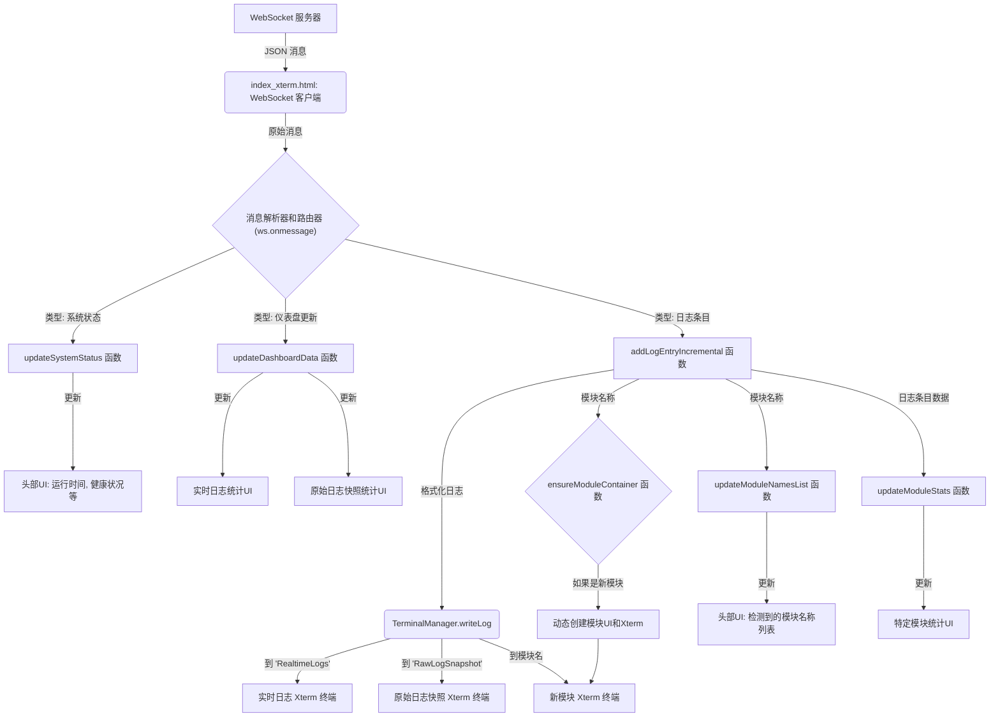

# 前端数据流程图分析 (`index_xterm.html`)

本文档分析 `index_xterm.html` 文件中的前端数据流，该页面用于监控K线聚合系统的模块。

## 1. 初始化与连接

1.  **页面加载 (`DOMContentLoaded`):**
    *   等待 Xterm.js 相关的库 (`Terminal`, `FitAddon`, `WebLinksAddon`) 加载完成 (`waitForXtermAndInitialize` 函数)。
    *   一旦库加载完毕，执行以下初始化步骤。

2.  **固定终端初始化 (`initializeFixedTerminals`):**
    *   创建两个固定的 Xterm.js 终端实例：
        *   `RealtimeLogs`: 用于显示所有实时的原始日志。
        *   `RawLogSnapshot`: 用于显示原始日志的高频折叠快照。
    *   这些终端由 `TerminalManager` 类管理。

3.  **WebSocket 连接 (`connectWebSocket`):**
    *   向后端 `/ws` 端点发起 WebSocket 连接。
    *   设置 `onopen`, `onmessage`, `onclose`, `onerror` 事件处理器。
    *   `onopen`: 记录连接成功，更新连接状态UI为“已连接”。如果存在重连定时器，则清除。
    *   `onclose`: 记录连接关闭，更新连接状态UI为“连接断开”。如果不存在重连定时器，则启动一个5秒的重连尝试。
    *   `onerror`: 记录错误，更新连接状态UI为“连接断开”。

## 2. WebSocket 消息处理 (`ws.onmessage`)

当从 WebSocket 接收到消息时，会进行JSON解析，并根据消息的 `type` 字段进行分发处理：

*   **`message.type === 'SystemStatus'`:**
    *   调用 `updateSystemStatus(message.data)` 函数。
    *   此函数更新页面头部的系统状态信息，例如：
        *   运行时间 (`#uptime`)
        *   健康分数 (`#health-score`)
        *   验证事件数 (`#validation-events`)
        *   性能监控跨度数 (`#performance-spans`)

*   **`message.type === 'LogEntry'`:**
    *   这是最核心的日志数据流。
    *   调用 `addLogEntryIncremental(message.data)` 函数处理单个日志条目。

*   **`message.type === 'DashboardUpdate'`:**
    *   调用 `updateDashboardData(message.data)` 函数。
    *   此函数用于更新聚合后的仪表盘数据，主要影响：
        *   **实时日志统计 (RealtimeLogs):** 更新 `#realtime-log-count`, `#last-log-time`, `#log-frequency`。
        *   **原始日志快照统计 (RawLogSnapshot):** 更新 `#snapshot-timestamp`, `#total-log-count`, `#displayed-log-count`。

## 3. 增量日志处理 (`addLogEntryIncremental`)

此函数是处理和显示单个日志条目的核心，流程如下：

1.  **格式化日志 (`formatLogEntry`):** 将原始日志对象（包含 `timestamp`, `level`, `module`, `message` 等字段）转换为适合在终端显示的字符串。
2.  **提取日志级别 (`extractLogLevel`):** 从日志对象或字符串中提取日志级别 (ERROR, WARN, INFO, DEBUG)，用于后续的颜色编码。
3.  **写入实时日志终端:** 将格式化后的日志写入名为 `RealtimeLogs` 的固定终端。使用 `terminalManager.writeLog` 方法，该方法会根据日志级别应用颜色。
4.  **写入模块特定终端:**
    *   从 `logEntry.target` 字段获取模块名称，如果不存在则默认为 `unknown`。
    *   调用 `ensureModuleContainer(moduleName)`：
        *   检查该模块的UI容器和Xterm终端是否已创建。
        *   如果未创建，则动态生成相应的HTML结构（模块头部、统计区域、终端容器），并初始化一个新的Xterm实例。
    *   将格式化后的日志写入对应模块的终端 (`terminalManager.writeLog`)。
5.  **写入原始日志快照终端:** 将格式化后的日志也写入名为 `RawLogSnapshot` 的固定终端。
6.  **更新模块名称列表 (`updateModuleNamesList`):**
    *   如果接收到的日志来自一个新的模块名称，则将该模块名称添加到页面顶部的“检测到的模块名称”列表中。
    *   这会动态创建一个可点击的模块名标签，点击可以复制模块名。
7.  **更新模块统计信息 (`updateModuleStats`):**
    *   更新对应模块的统计数据，如总日志数、错误数、最后更新时间。

## 4. 终端管理 (`TerminalManager` 类)

此类负责管理页面上所有的 Xterm.js 终端实例。

*   `createTerminal(containerId, moduleName)`: 在指定的HTML容器 (`containerId`) 内创建并配置一个新的Xterm终端实例，并与一个 `moduleName`关联。加载必要的Xterm插件（如 `FitAddon` 用于自适应大小，`WebLinksAddon` 用于链接识别）。
*   `getTerminal(moduleName)`: 获取指定模块名称的终端实例。
*   `writeLog(moduleName, logText, level)`: 向指定模块的终端写入日志文本。根据 `level` 参数应用ANSI颜色代码，实现彩色日志输出，并自动滚动到底部。
*   `clearTerminal(moduleName)`: 清空指定模块的终端内容。
*   `resizeTerminal(moduleName)`: 调整指定模块终端的大小以适应其容器。
*   `destroyTerminal(moduleName)`: 销毁指定模块的终端实例。

## 5. UI 更新与交互

*   **动态模块创建 (`ensureModuleContainer`):** 当收到来自新模块的日志时，会自动在页面上创建该模块的显示区域，包括标题、统计信息和专属的日志终端。
*   **模块名称列表 (`updateModuleNamesList`):** 动态维护页面顶部的模块名称列表。每个模块名都是一个可点击的标签，方便用户复制。
*   **统计信息更新:** 各模块的统计信息（总日志数、错误数、最后更新时间）以及全局统计（如实时日志总数、频率）会随着新数据的到来而实时更新。
*   **连接状态 (`updateConnectionStatus`):** 页面右上角显示WebSocket的连接状态（连接中...、已连接、连接断开）。
*   **按钮交互:**
    *   “复制全部模块”按钮 (`#header-copy-modules`): 点击后复制所有已检测到的模块名称到剪贴板。
    *   “显示/隐藏实时原始日志”按钮 (`#toggle-realtime-logs`): 控制 `RealtimeLogs` 模块的显示和隐藏。
*   **窗口大小调整:** 监听 `window.resize` 事件，当窗口大小改变时，自动调用 `terminalManager.resizeTerminal` 调整所有终端的尺寸。

## 数据流向图概览

这个流程确保了日志数据能够被实时接收、处理，并以结构化和用户友好的方式展示在对应的模块终端和统计区域中。系统还具备动态适应新模块的能力。