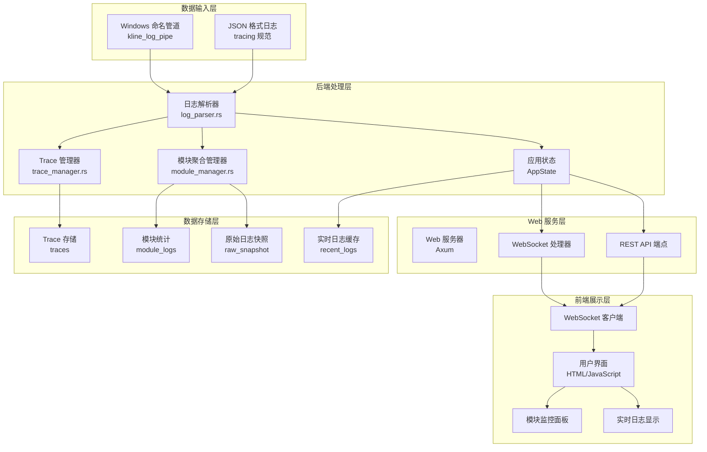

# WebLog 系统数据流程详细文档

## 概述

WebLog 是一个专用于 Windows 命名管道的高性能 JSON 日志可视化系统，提供实时日志流显示、Trace/Span 可视化、结构化日志解析和性能指标分析。

## 系统架构图



## 详细数据流程

### 1. 数据输入流程

#### 1.1 命名管道连接
```rust
// 位置: src/weblog/bin/weblog.rs
async fn process_named_pipe_logs(state: Arc<AppState>, pipe_name: String) {
    // 创建命名管道服务器
    let pipe_server = create_named_pipe_server(&pipe_name).await;
    
    // 等待客户端连接
    pipe_server.connect().await;
    
    // 逐行读取日志
    let mut reader = AsyncBufReader::new(pipe_server);
    loop {
        let line = reader.read_line().await;
        process_log_line(&state, line.trim()).await;
    }
}
```

#### 1.2 日志解析流程
```rust
// 位置: src/weblog/bin/weblog.rs
async fn process_log_line(state: &Arc<AppState>, line: &str) {
    // 1. 添加原始日志到缓存
    state.add_raw_log(line.to_string());
    
    // 2. 解析 JSON 格式的 tracing 日志
    if let Some(log_entry) = parse_tracing_log_line(line) {
        if validate_log_entry(&log_entry) {
            // 3. 更新各种统计和存储
            update_module_stats(&state, &log_entry);
            update_trace_manager(&state, &log_entry);
            update_module_aggregator(&state, &log_entry);
            
            // 4. 广播日志条目
            state.log_sender.send(log_entry);
        }
    }
}
```

### 2. 后端数据处理

#### 2.1 模块聚合管理器 (ModuleAggregatorManager)
```rust
// 位置: src/weblog/src/module_manager.rs
impl ModuleAggregatorManager {
    pub async fn process_log_entry(&self, log_entry: LogEntry) {
        let module_name = log_entry.target.clone();
        
        // 添加到模块聚合器
        self.process_module_logs(&module_name, vec![log_entry.clone()]).await;
        
        // 添加到原始日志快照聚合器
        let mut raw_aggregator = self.raw_snapshot_aggregator.write().await;
        raw_aggregator.add_log_entry(log_entry);
    }
}
```

#### 2.2 日志聚合器 (LogAggregator)
```rust
// 位置: src/weblog/src/log_aggregator.rs
impl LogAggregator {
    pub fn add_log_entry(&mut self, log_entry: LogEntry) -> bool {
        // 生成唯一键防止重复
        let unique_key = format!("{}-{}", 
            log_entry.timestamp.timestamp_millis(), 
            self.generate_log_key(&log_entry)
        );
        
        // 检查重复
        if self.processed_logs.contains(&unique_key) {
            return false;
        }
        
        // 直接创建新条目（聚合功能已禁用）
        self.create_new_entry(log_entry, now);
        self.limit_displayed_logs();
        
        true
    }
}
```

### 3. WebSocket 实时通信

#### 3.1 WebSocket 连接处理
```rust
// 位置: src/weblog/src/web_server.rs
async fn websocket_connection(socket: WebSocket, state: Arc<AppState>) {
    let (mut sender, mut receiver) = socket.split();
    let mut log_receiver = state.log_sender.subscribe();
    
    // 发送初始仪表板数据
    send_dashboard_data(&mut sender, &state).await;
    
    // 处理实时日志广播
    loop {
        tokio::select! {
            // 立即转发日志条目
            log_result = log_receiver.recv() => {
                if let Ok(log_entry) = log_result {
                    let message = WebSocketMessage::LogEntry { data: log_entry };
                    sender.send(Message::Text(serde_json::to_string(&message)?)).await;
                }
            }
            
            // 定期发送系统状态
            _ = tokio::time::sleep(Duration::from_secs(10)) => {
                let system_status = state.get_system_status();
                let message = WebSocketMessage::SystemStatus { data: system_status };
                sender.send(Message::Text(serde_json::to_string(&message)?)).await;
            }
        }
    }
}
```

#### 3.2 仪表板数据发送
```rust
async fn send_dashboard_data(sender: &mut SplitSink, state: &Arc<AppState>) {
    let uptime = state.start_time.elapsed().unwrap_or_default().as_secs();
    let health_score = 95;
    
    let mut dashboard_data = state.module_aggregator_manager
        .get_dashboard_data(uptime, health_score).await;
    
    // 从 AppState 获取实时日志数据
    dashboard_data.realtime_log_data = state.get_realtime_log_data();
    
    let message = WebSocketMessage::DashboardUpdate { data: dashboard_data };
    sender.send(Message::Text(serde_json::to_string(&message)?)).await;
}
```

### 4. 前端数据处理

#### 4.1 WebSocket 客户端连接
```javascript
// 位置: src/weblog/static/index.html
function connectWebSocket() {
    const protocol = window.location.protocol === 'https:' ? 'wss:' : 'ws:';
    const wsUrl = `${protocol}//${window.location.host}/ws`;
    
    ws = new WebSocket(wsUrl);
    
    ws.onopen = function() {
        console.log('🔗 WebSocket已连接');
        updateConnectionStatus(true);
    };
    
    ws.onmessage = function(event) {
        const message = JSON.parse(event.data);
        
        if (message.type === 'DashboardUpdate') {
            updateDashboardWithAggregatedData(message.data);
        } else if (message.type === 'LogEntry') {
            addLogEntryToRealtimeDisplay(message.data);
        }
    };
}
```

#### 4.2 仪表板数据更新
```javascript
function updateDashboardWithAggregatedData(dashboardData) {
    // 更新系统状态
    updateSystemInfo(dashboardData);
    
    // 更新模块日志
    updateModuleLogs(dashboardData.module_logs);
    
    // 更新实时日志
    updateRealtimeLogData(dashboardData.realtime_log_data);
    
    // 更新原始日志快照
    updateRawLogSnapshot(dashboardData.raw_log_snapshot);
}
```

## 数据结构定义

### 核心数据类型

#### LogEntry (日志条目)
```rust
#[derive(Debug, Clone, Serialize, Deserialize)]
pub struct LogEntry {
    pub timestamp: DateTime<Utc>,
    pub level: String,           // INFO, WARN, ERROR, DEBUG
    pub target: String,          // 模块名称
    pub message: String,         // 日志消息
    pub module_path: Option<String>,
    pub file: Option<String>,
    pub line: Option<u32>,
    pub fields: HashMap<String, serde_json::Value>,
    pub span: Option<SpanInfo>,
}
```

#### DisplayLogEntry (显示日志条目)
```rust
#[derive(Debug, Clone, Serialize)]
pub struct DisplayLogEntry {
    pub message: String,
    pub level: String,
    pub timestamp: DateTime<Utc>,
    pub count: usize,           // 聚合计数
    pub is_aggregated: bool,    // 是否为聚合日志
    pub variations: Vec<String>, // 消息变体
    pub all_logs: Vec<LogEntry>, // 所有原始日志
}
```

#### DashboardData (仪表板数据)
```rust
#[derive(Debug, Serialize)]
pub struct DashboardData {
    pub uptime_seconds: u64,
    pub health_score: u8,
    pub module_logs: HashMap<String, ModuleDisplayData>,
    pub realtime_log_data: RealtimeLogData,
    pub raw_log_snapshot: RawSnapshotData,
}
```

### WebSocket 消息协议

#### 消息类型枚举
```rust
#[derive(Debug, Serialize)]
#[serde(tag = "type")]
pub enum WebSocketMessage {
    LogEntry { data: LogEntry },                    // 单个日志条目
    TraceUpdate { trace_id: String, trace: Trace }, // Trace 更新
    SpanUpdate { span_id: String, span: Span },     // Span 更新
    TargetsUpdate { targets: Vec<String> },         // 目标列表更新
    TraceList { traces: Vec<Trace> },               // Trace 列表
    StatsUpdate { data: LogStats },                 // 统计信息更新
    SystemStatus { data: SystemStatus },            // 系统状态更新
    DashboardUpdate { data: DashboardData },        // 仪表板数据更新
}
```
