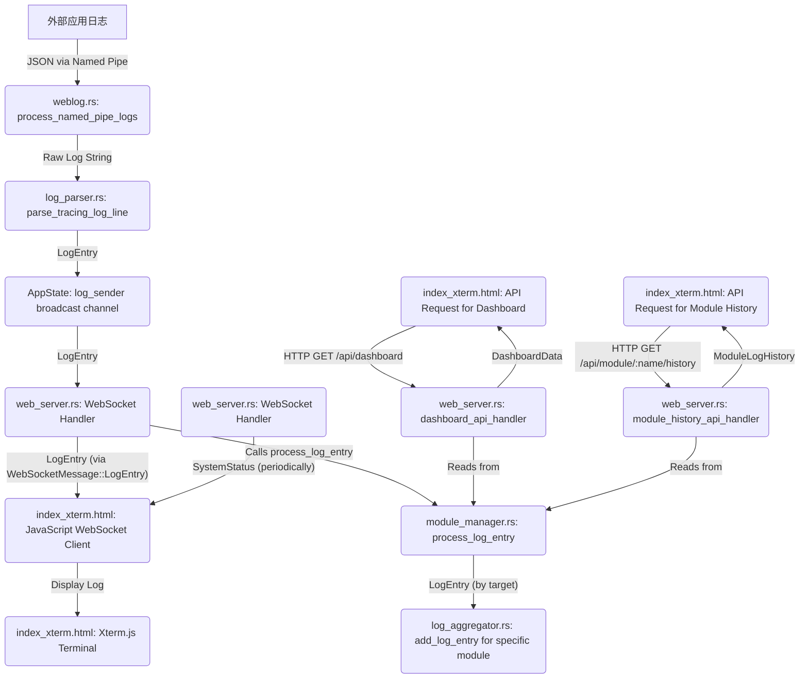

# WebLog 系统数据流程图

本文档描述了 WebLog 系统前端和后端之间的数据流动路径。

## 核心组件

*   **前端 (`index_xterm.html`)**: 用户界面，通过 WebSocket 与后端通信，使用 `xterm.js` 显示日志。
*   **后端入口 (`bin/weblog.rs`)**: 启动服务，监听命名管道，初始化 Web 服务和日志处理逻辑。
*   **日志解析器 (`src/log_parser.rs`)**: 解析从命名管道传入的 JSON 日志字符串为结构化的 `LogEntry`。
*   **日志聚合器 (`src/log_aggregator.rs`)**: (当前版本主要功能为存储和去重，聚合逻辑已禁用) 负责处理单个模块的日志条目。
*   **模块管理器 (`src/module_manager.rs`)**: 管理多个模块的 `LogAggregator` 实例，并提供聚合后的数据视图。
*   **Web 服务器 (`src/web_server.rs`)**: 提供 HTTP API 接口和 WebSocket 服务，用于与前端交互。
*   **应用状态 (`AppState` in `src/lib.rs` or `bin/weblog.rs`)**: 存储全局状态，包括日志发送通道 (`log_sender`)、模块聚合管理器等。

## 数据流图示 (简化)

## 详细数据流步骤

1.  **日志产生与输入 (外部应用 -> 后端 `weblog.rs`)**
    *   外部 Rust 应用程序使用 `tracing` 库产生日志。
    *   日志通过配置好的 `tracing-subscriber` 以 JSON 格式输出到指定的命名管道。
    *   后端的 `weblog.rs` 中的 `process_named_pipe_logs` 异步任务持续监听此命名管道。

2.  **日志接收与初步处理 (后端 `weblog.rs`)**
    *   当命名管道接收到新的日志数据（通常是换行符分隔的 JSON 字符串）时，`process_named_pipe_logs` 读取该行数据。
    *   读取到的原始日志字符串会传递给 `log_parser::parse_tracing_log_line` 函数进行解析。

3.  **日志解析 (后端 `log_parser.rs`)**
    *   `parse_tracing_log_line` 尝试将输入的字符串解析为 `serde_json::Value`。
    *   如果解析成功，`parse_tracing_json` 函数会从 JSON 对象中提取关键字段（如 `timestamp`, `level`, `target`, `message`, `fields`, `span` 等）。
    *   这些字段被构造成一个结构化的 `LogEntry` 对象。

4.  **日志分发 (后端 `AppState` & `weblog.rs`)**
    *   成功解析出的 `LogEntry` 对象通过 `AppState` 内的 `log_sender` (一个 `tokio::sync::broadcast::Sender`) 发送出去。
    *   同时，原始的日志行字符串会被添加到 `AppState` 的 `raw_log_buffer` 中，用于原始日志的显示。

5.  **WebSocket 推送 (后端 `web_server.rs` -> 前端 `index_xterm.html`)**
    *   `web_server.rs` 中的 `websocket_connection` 函数处理 WebSocket 连接。
    *   每个 WebSocket 连接都会订阅 `AppState` 的 `log_sender`。
    *   当 `log_sender` 广播一个新的 `LogEntry` 时：
        *   该 `LogEntry` 被封装在 `WebSocketMessage::LogEntry` 枚举中。
        *   序列化为 JSON 字符串后，通过 WebSocket 连接发送给所有连接的前端客户端。
    *   `websocket_connection` 还会定期（例如每10秒）获取当前的 `SystemStatus`（包含模块列表、连接状态等），封装在 `WebSocketMessage::SystemStatus` 中，并推送给前端。

6.  **日志聚合与存储 (后端 `module_manager.rs` & `log_aggregator.rs`)**
    *   在 `websocket_connection` 函数中，当收到从 `log_sender` 传来的 `LogEntry` 后，会调用 `state.module_aggregator_manager.process_log_entry(log_entry.clone()).await`。
    *   `ModuleAggregatorManager` 的 `process_log_entry` 方法：
        *   根据 `LogEntry` 的 `target` 字段（通常代表模块名）找到或创建一个对应的 `LogAggregator` 实例。
        *   调用该 `LogAggregator` 实例的 `add_log_entry` 方法。
        *   `LogAggregator` (当前版本禁用了实际的聚合逻辑) 将 `LogEntry` 存储在其内部的 `displayed_logs` 队列中，并使用 `processed_logs` 集合进行简单去重，以避免完全相同的日志条目（基于时间戳和消息内容）被重复处理。
        *   `LogEntry` 也会被添加到全局的 `raw_snapshot_aggregator` 中，用于提供一个所有模块原始日志的快照视图。

7.  **前端接收与显示 (前端 `index_xterm.html`)**
    *   前端 JavaScript 代码通过 WebSocket 接收后端推送的 `WebSocketMessage`。
    *   **`WebSocketMessage::LogEntry`**: 
        *   解析出 `LogEntry` 数据。
        *   根据 `LogEntry.target` 找到页面上对应的模块显示区域。
        *   将日志信息追加到该模块的 `xterm.js` 终端实例中，实现实时日志滚动显示。
    *   **`WebSocketMessage::SystemStatus`**: 
        *   更新页面顶部的系统连接状态。
        *   动态更新模块列表的显示，包括各模块的名称、状态指示灯等。

8.  **前端请求初始/历史数据 (前端 `index_xterm.html` -> 后端 `web_server.rs`)**
    *   **仪表板数据**: 
        *   页面加载时或用户操作时，前端可能会向后端的 `/api/dashboard` 发起 HTTP GET 请求。
        *   `dashboard_api_handler` 在后端处理此请求，它会从 `ModuleAggregatorManager` 获取所有模块的聚合数据和原始日志快照数据，并从 `AppState` 获取最新的实时原始日志行。
        *   这些数据组合成 `DashboardData` 对象，序列化为 JSON 返回给前端。
        *   前端使用这些数据初始化或更新仪表板的各个部分。
    *   **模块历史日志**: 
        *   用户可能在前端请求特定模块的更详细历史日志，前端会向 `/api/module/{module_name}/history` (可带分页参数) 发起 HTTP GET 请求。
        *   `module_history_api_handler` 处理请求，从 `ModuleAggregatorManager` 获取指定模块的 `recent_logs` (完整的原始日志历史，有数量限制)，并根据分页参数返回部分数据。
        *   前端接收到历史日志数据后，可以在相应的模块区域展示。

## 数据结构关键点

*   **`LogEntry`**: 核心日志数据结构，包含时间戳、级别、目标模块、消息内容、结构化字段、Span 信息等。
*   **`DisplayLogEntry`**: 在 `LogAggregator` 中使用，聚合后的日志显示条目（当前版本由于聚合禁用，与 `LogEntry` 结构上相似，但增加了 `count`, `is_aggregated`, `variations`, `all_logs` 字段）。
*   **`ModuleDisplayData`**: `ModuleManager` 提供给前端的单个模块的显示数据，包含统计信息和 `DisplayLogEntry` 列表。
*   **`DashboardData`**: `/api/dashboard` 返回的整体仪表板数据，包含所有模块的 `ModuleDisplayData`、实时日志数据和原始日志快照。
*   **`WebSocketMessage`**: 前后端 WebSocket 通信的消息类型，主要有 `LogEntry` (增量日志) 和 `SystemStatus` (系统状态)。

这个流程确保了日志从产生到最终在用户界面上显示的完整路径，兼顾了实时性和历史数据的可查询性。