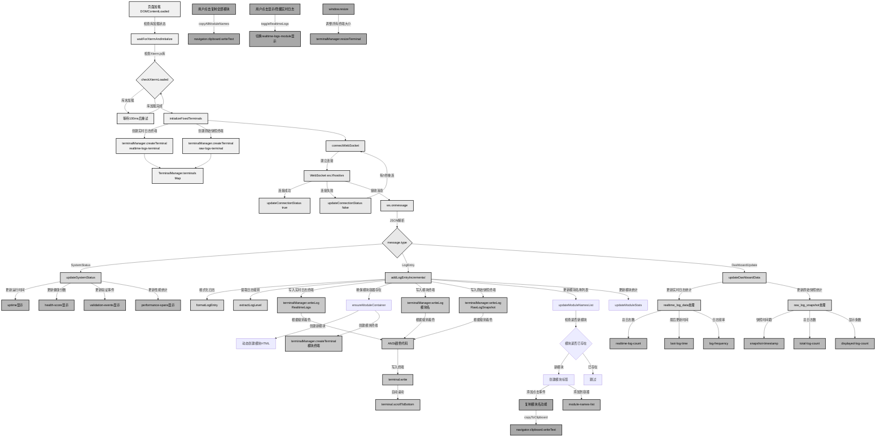
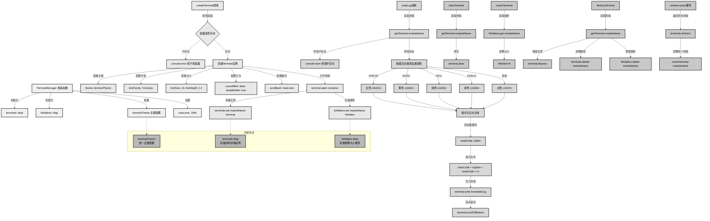

# WebLog前端数据流程分析文档

## 概述

本文档详细分析了 `src\weblog\static\index_xterm.html` 前端文件的数据流程，包括页面初始化、WebSocket通信、终端管理、消息处理和用户交互等核心功能。

## 1. 整体前端数据流程图



### 流程说明

#### 1.1 页面初始化阶段
- **DOMContentLoaded事件触发**：页面DOM加载完成后开始初始化
- **库加载检测**：检查Xterm.js相关库是否加载完成，未加载则等待重试
- **固定终端创建**：创建实时日志终端和原始快照终端
- **WebSocket连接建立**：连接到后端WebSocket服务

#### 1.2 消息处理阶段
- **消息类型分发**：根据message.type字段分发到不同处理函数
- **SystemStatus**：更新系统状态信息（运行时间、健康分数等）
- **LogEntry**：核心增量处理，立即写入多个终端
- **DashboardUpdate**：更新聚合统计信息

#### 1.3 核心增量流程
- **多终端写入**：每个日志条目同时写入实时日志、模块日志、原始快照三个终端
- **动态模块创建**：根据日志target字段动态创建新的模块容器和终端
- **实时统计更新**：更新模块统计信息和名称列表

## 2. TerminalManager 类内部数据流程



### TerminalManager 核心功能

#### 2.1 终端实例管理
- **Map存储结构**：使用Map<string, Terminal>存储所有终端实例
- **插件管理**：使用Map<string, FitAddon>管理调整大小插件
- **统一主题配置**：所有终端使用相同的主题和字体配置

#### 2.2 日志写入机制
- **ANSI颜色支持**：根据日志级别自动设置颜色代码
- **格式化处理**：添加颜色代码和重置代码
- **自动滚动**：写入后自动滚动到底部

#### 2.3 生命周期管理
- **创建**：检查容器存在性，配置终端参数，存储到Map
- **写入**：获取终端实例，格式化文本，写入并滚动
- **调整**：响应窗口大小变化，调整所有终端
- **销毁**：清理终端实例和相关映射

## 3. 前端消息处理与UI更新详细流程

```mermaid
flowchart TD
    %% WebSocket消息接收
    A[WebSocket.onmessage] -->|接收原始消息| B[event.data]
    B -->|JSON.parse| C{解析成功?}
    C -->|失败| D[console.error 解析失败]
    C -->|成功| E[message对象]

    %% 消息类型分发
    E -->|检查type字段| F{message.type}
    F -->|SystemStatus| G[updateSystemStatus]
    F -->|LogEntry| H[addLogEntryIncremental]
    F -->|DashboardUpdate| I[updateDashboardData]
    F -->|未知类型| J[console.log 未知消息类型]

    %% SystemStatus处理分支
    G -->|data.uptime_seconds| K[计算时分秒格式]
    K -->|更新DOM| L[document.getElementById uptime]
    G -->|data.health_score| M[Math.round处理]
    M -->|更新DOM| N[document.getElementById health-score]
    G -->|validation_stats| O[data.validation_stats.total_events]
    O -->|更新DOM| P[document.getElementById validation-events]
    G -->|performance_stats| Q[data.performance_stats.total_spans]
    Q -->|更新DOM| R[document.getElementById performance-spans]

    %% LogEntry处理分支 - 核心增量流程
    H -->|格式化| S[formatLogEntry]
    H -->|提取级别| T[extractLogLevel]

    S -->|检查类型| U{logEntry类型}
    U -->|字符串| V[直接返回]
    U -->|对象有message| W[组装时间戳+级别+模块+消息]
    U -->|其他| X[JSON.stringify]

    T -->|检查level字段| Y{有level字段?}
    Y -->|有| Z[返回level.toUpperCase]
    Y -->|无| AA[从字符串中检测ERROR/WARN/INFO/DEBUG]

    %% 多终端写入
    H -->|写入1| BB[terminalManager.writeLog RealtimeLogs]
    H -->|获取模块名| CC[logEntry.target or unknown]
    CC -->|确保容器| DD[ensureModuleContainer]
    DD -->|写入2| EE[terminalManager.writeLog moduleName]
    H -->|写入3| FF[terminalManager.writeLog RawLogSnapshot]

    %% 动态模块创建
    DD -->|检查是否存在| GG{createdModules.has moduleName}
    GG -->|已存在| HH[跳过创建]
    GG -->|不存在| II[创建模块HTML结构]
    II -->|设置innerHTML| JJ[模块头部+统计+终端容器]
    II -->|添加到DOM| KK[modulesContainer.appendChild]
    II -->|创建终端| LL[terminalManager.createTerminal]
    II -->|标记已创建| MM[createdModules.add moduleName]

    %% 模块名称列表更新
    H -->|更新列表| NN[updateModuleNamesList]
    NN -->|检查新模块| OO{currentModuleNames.includes}
    OO -->|已存在| PP[跳过]
    OO -->|新模块| QQ[创建模块标签]
    QQ -->|设置属性| RR[className textContent title id]
    QQ -->|添加事件| SS[addEventListener click copyToClipboard]
    QQ -->|添加到DOM| TT[container.appendChild]
    QQ -->|更新数组| UU[currentModuleNames.push]

    %% 模块统计更新
    H -->|更新统计| VV[updateModuleStats]
    VV -->|总日志数+1| WW[getElementById containerId-total]
    VV -->|错误数处理| XX{logEntry.level === ERROR}
    XX -->|是| YY[错误数+1]
    XX -->|否| ZZ[跳过]
    VV -->|更新时间| AAA[getElementById containerId-last-update]
    VV -->|更新状态| BBB[getElementById containerId-status]

    %% DashboardUpdate处理分支
    I -->|实时日志数据| CCC[data.realtime_log_data]
    CCC -->|total_count| DDD[getElementById realtime-log-count]
    CCC -->|last_update_time| EEE[getElementById last-log-time]
    CCC -->|logs_per_second| FFF[getElementById log-frequency]

    I -->|原始快照数据| GGG[data.raw_log_snapshot]
    GGG -->|timestamp| HHH[getElementById snapshot-timestamp]
    GGG -->|total_count| III[getElementById total-log-count]
    GGG -->|displayed_logs.length| JJJ[getElementById displayed-log-count]

    %% 用户交互处理
    KKK[用户点击复制全部模块] -->|检查数组长度| LLL{currentModuleNames.length > 0}
    LLL -->|为空| MMM[alert 暂无模块数据可复制]
    LLL -->|有数据| NNN[join n]
    NNN -->|复制到剪贴板| OOO[navigator.clipboard.writeText]
    OOO -->|成功| PPP[按钮显示已复制]
    OOO -->|失败| QQQ[console.error]

    RRR[用户点击显示/隐藏实时日志] -->|检查当前状态| SSS{realtime-logs-module.style.display}
    SSS -->|隐藏| TTT[显示模块 按钮变active]
    SSS -->|显示| UUU[隐藏模块 按钮变inactive]
    TTT -->|调整大小| VVV[terminalManager.resizeTerminal]

    %% 样式定义 - 高对比度黑色主题
    classDef websocket fill:#f0f0f0,stroke:#000000,stroke-width:2px,color:#000000
    classDef parse fill:#e8e8e8,stroke:#000000,stroke-width:2px,color:#000000
    classDef system fill:#d8d8d8,stroke:#000000,stroke-width:2px,color:#000000
    classDef logentry fill:#c8c8c8,stroke:#000000,stroke-width:2px,color:#000000
    classDef dashboard fill:#b8b8b8,stroke:#000000,stroke-width:2px,color:#000000
    classDef interaction fill:#a8a8a8,stroke:#000000,stroke-width:2px,color:#000000
    classDef terminal fill:#989898,stroke:#000000,stroke-width:2px,color:#000000

    class A,B,C,D,E websocket
    class F,J parse
    class G,K,L,M,N,O,P,Q,R system
    class H,S,T,U,V,W,X,Y,Z,AA,BB,CC,DD,EE,FF,NN,OO,PP,QQ,RR,SS,TT,UU,VV,WW,XX,YY,ZZ,AAA,BBB logentry
    class I,CCC,DDD,EEE,FFF,GGG,HHH,III,JJJ dashboard
    class KKK,LLL,MMM,NNN,OOO,PPP,QQQ,RRR,SSS,TTT,UUU,VVV interaction
    class GG,HH,II,JJ,KK,LL,MM terminal
```



### 消息处理详细说明

#### 3.1 WebSocket消息接收与解析
- **原始消息接收**：WebSocket.onmessage事件接收后端发送的JSON字符串
- **JSON解析**：使用JSON.parse解析消息，失败时记录错误
- **类型分发**：根据message.type字段分发到对应的处理函数

#### 3.2 SystemStatus消息处理
- **运行时间计算**：将秒数转换为时:分:秒格式显示
- **健康分数处理**：使用Math.round四舍五入后显示百分比
- **统计信息更新**：更新验证事件数和性能统计数据

#### 3.3 LogEntry消息处理（核心流程）
- **日志格式化**：根据日志类型（字符串/对象）进行不同的格式化处理
- **级别提取**：从日志对象或字符串中提取日志级别
- **多终端写入**：同时写入实时日志、模块日志、原始快照三个终端
- **动态模块创建**：检查模块是否存在，不存在则动态创建HTML结构和终端
- **统计信息更新**：更新模块的日志计数、错误计数、最后更新时间等

#### 3.4 DashboardUpdate消息处理
- **实时日志统计**：更新总日志数、最后更新时间、日志频率
- **原始快照统计**：更新快照时间戳、总日志数、显示条数

#### 3.5 用户交互处理
- **复制功能**：支持复制单个模块名或所有模块名到剪贴板
- **显示切换**：支持显示/隐藏实时日志终端
- **视觉反馈**：复制成功时显示临时反馈信息

## 4. 关键技术特点

### 4.1 增量流式架构
- **立即转发**：后端收到新日志立即通过WebSocket转发，前端立即显示
- **多终端同步**：每个日志条目同时写入三个终端（实时、模块、快照）
- **避免全量刷新**：使用append模式而非替换模式，提高性能

### 4.2 专业终端体验
- **Xterm.js集成**：使用业界成熟的终端组件，提供类似命令行的体验
- **ANSI颜色支持**：根据日志级别自动着色（ERROR红色、WARN黄色、INFO绿色等）
- **自动滚动**：新日志自动滚动到底部，保持最新内容可见
- **缓冲管理**：每个终端最多保留1000行，自动清理旧内容

### 4.3 动态模块管理
- **按需创建**：根据日志的target字段动态创建模块容器和终端
- **独立统计**：每个模块独立统计日志数、错误数、最后更新时间
- **模块列表**：实时更新模块名称列表，支持点击复制功能

### 4.4 错误处理与容错
- **连接管理**：WebSocket断线自动重连（每5秒重试）
- **库加载检测**：等待Xterm.js库加载完成后再初始化
- **容器检查**：创建终端前检查DOM容器是否存在
- **异常捕获**：JSON解析失败、终端不存在等异常都有相应处理

### 4.5 用户体验优化
- **视觉反馈**：复制操作有明显的视觉反馈（按钮变色、文字变化）
- **响应式设计**：窗口大小变化时自动调整所有终端大小
- **状态指示**：连接状态、模块状态都有清晰的视觉指示
- **交互便利**：支持一键复制所有模块名、快速显示/隐藏功能

## 5. 数据结构与状态管理

### 5.1 全局状态变量
```javascript
// WebSocket连接
let ws = null;
let reconnectInterval = null;

// 模块管理
let createdModules = new Set();        // 已创建的模块集合
let currentModuleNames = [];           // 当前模块名称数组

// 终端管理器实例
const terminalManager = new TerminalManager();
```

### 5.2 TerminalManager内部状态
```javascript
class TerminalManager {
    constructor() {
        this.terminals = new Map();     // 存储所有终端实例
        this.fitAddons = new Map();     // 存储FitAddon实例
        this.maxLines = 1000;           // 每个终端最大行数
        this.terminalTheme = {...};     // 统一主题配置
    }
}
```

### 5.3 消息协议格式
```javascript
// LogEntry消息
{
    "type": "LogEntry",
    "data": {
        "message": "日志内容",
        "level": "INFO",
        "target": "模块名",
        "timestamp": "2024-01-01T12:00:00Z"
    }
}

// DashboardUpdate消息
{
    "type": "DashboardUpdate",
    "data": {
        "realtime_log_data": {
            "total_count": 1234,
            "last_update_time": "12:34:56",
            "logs_per_second": 5.2
        },
        "raw_log_snapshot": {
            "timestamp": "2024-01-01T12:00:00Z",
            "total_count": 5678,
            "displayed_logs": [...]
        }
    }
}

// SystemStatus消息
{
    "type": "SystemStatus",
    "data": {
        "uptime_seconds": 3661,
        "health_score": 95.5,
        "validation_stats": {"total_events": 100},
        "performance_stats": {"total_spans": 50}
    }
}
```

## 6. 性能优化策略

### 6.1 DOM操作优化
- **批量更新**：模块创建时一次性设置innerHTML，避免多次DOM操作
- **存在性检查**：创建前检查模块是否已存在，避免重复创建
- **事件委托**：使用addEventListener而非内联事件处理

### 6.2 内存管理
- **终端缓冲限制**：每个终端最多保留1000行，自动清理旧内容
- **Map数据结构**：使用Map而非Object存储终端实例，提高查找效率
- **及时清理**：销毁终端时同时清理Map中的引用

### 6.3 网络优化
- **增量传输**：只传输新的日志条目，不传输全量数据
- **消息分类**：不同类型消息使用不同的更新频率（日志立即，状态10秒）
- **自动重连**：连接断开时自动重连，保证数据连续性

## 7. 总结

`index_xterm.html` 前端文件实现了一个功能完整、性能优化的实时日志监控系统：

1. **架构设计**：采用增量流式架构，实现了高效的实时数据展示
2. **用户体验**：集成专业终端组件，提供类似命令行的操作体验
3. **功能完整**：支持多模块管理、动态创建、统计展示、用户交互等
4. **性能优化**：通过多种策略优化DOM操作、内存使用和网络传输
5. **容错处理**：完善的错误处理和异常恢复机制

这个实现体现了现代Web应用在实时数据可视化方面的最佳实践，特别适合用于监控和调试高频数据流的场景。
